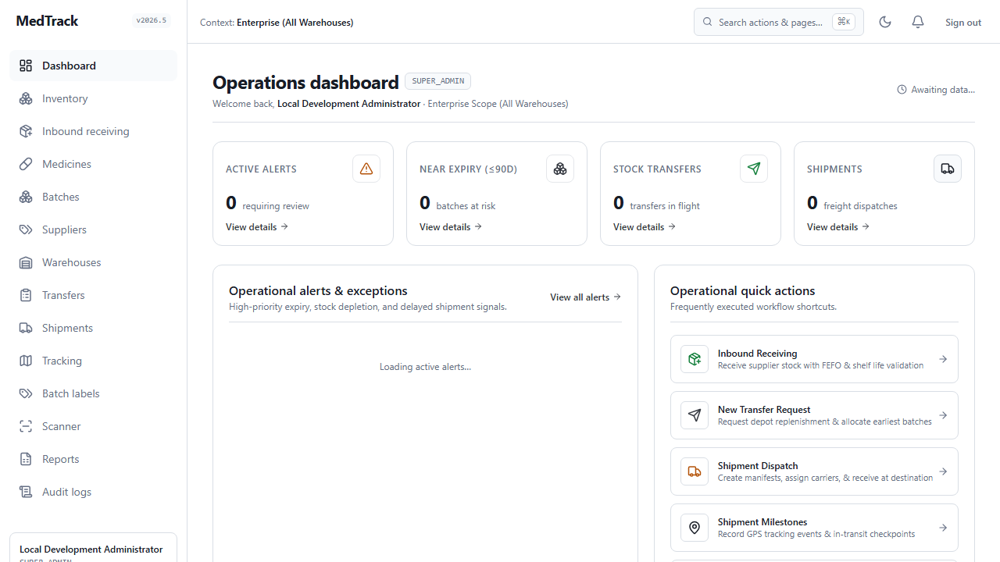
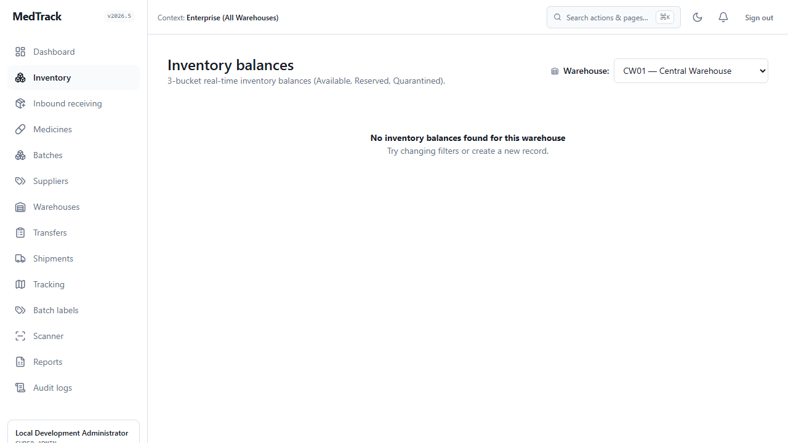
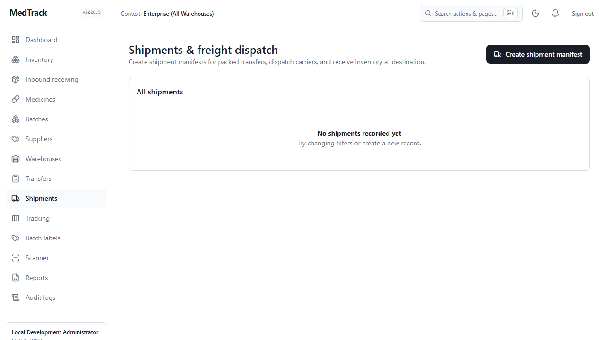
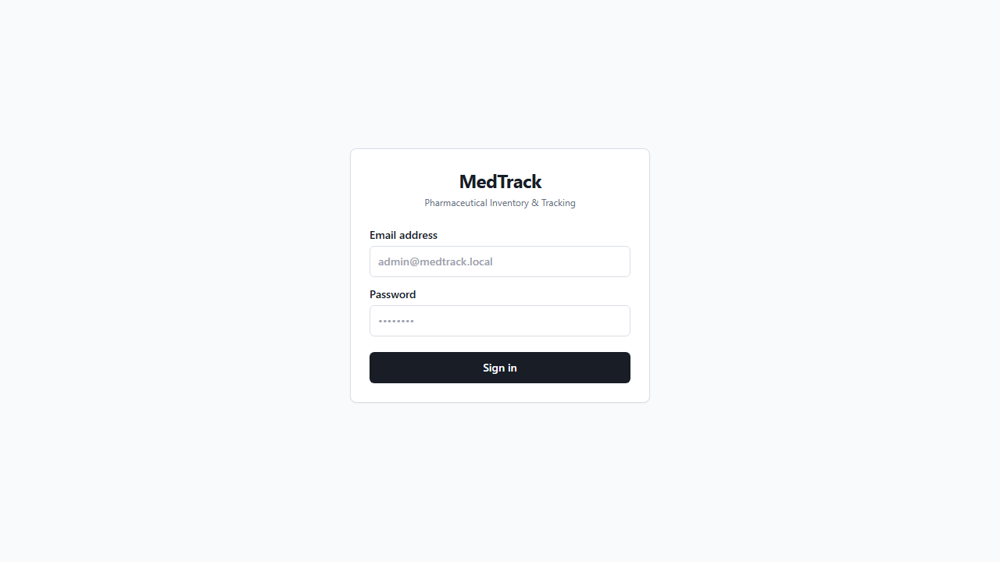
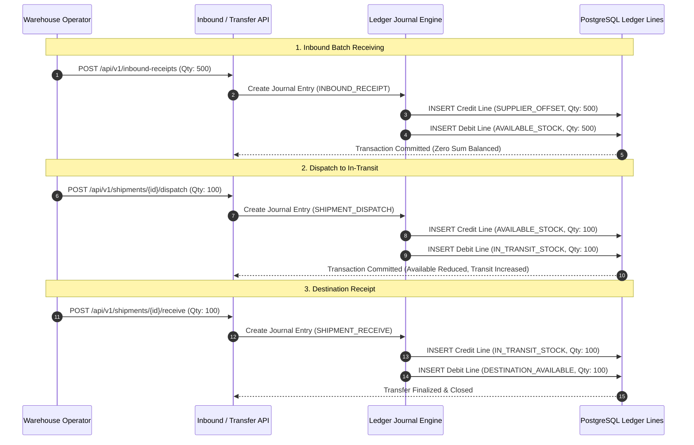
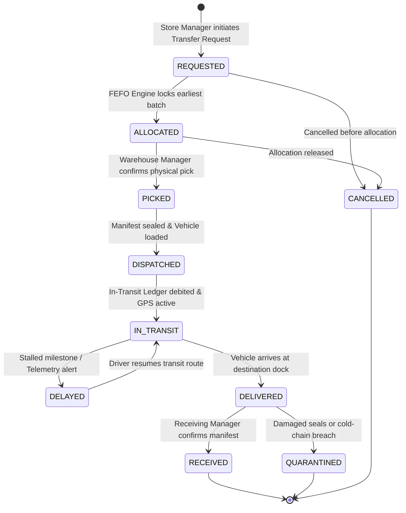
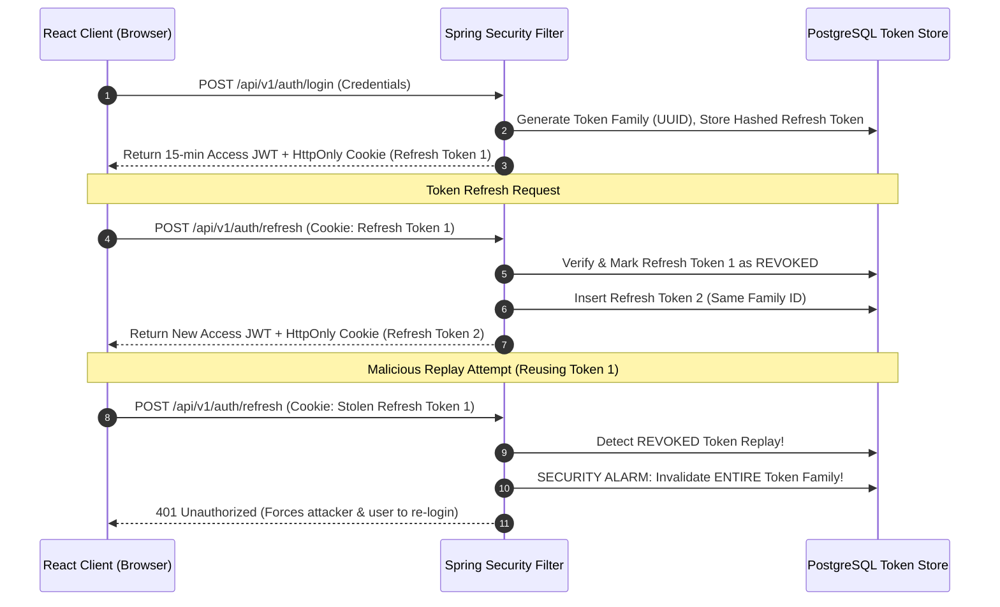

<div align="center">

# 💊 MedTrack

### Enterprise Pharmaceutical Inventory, Transportation & Cold-Chain Tracking Platform

[](https://medtrack-frontend-7yhw.onrender.com)
[](https://medtrack-backend-45zt.onrender.com/actuator/health)
[](https://github.com/snmallick2401/MedTrack/actions/workflows/ci.yml)
[](https://openjdk.org/)
[](https://spring.io/projects/spring-boot)
[](https://www.postgresql.org/)
[](https://react.dev/)
[](https://www.typescriptlang.org/)
[](https://vitejs.dev/)
[](https://tailwindcss.com/)
[](https://playwright.dev/)
[](https://www.fda.gov/)
[](docs/api/openapi.yaml)
[](LICENSE)

<p align="center">
  <b>Enterprise-grade, GxP-compliant pharmaceutical inventory management and inter-facility logistics.</b><br/>
  Featuring double-entry ledger accounting, automated FEFO allocation, minimum shelf-life enforcement, 2D QR / Code-128 labeling, in-browser optical scanning, real-time transportation telemetry, and cryptographic audit trails.
</p>

[🌐 Live Web Application](https://medtrack-frontend-7yhw.onrender.com) • [🖥️ Live Screenshots](#%EF%B8%8F-live-application-preview--screenshots) • [System Architecture](docs/architecture.md) • [API Specification](docs/api/openapi.yaml) • [Database Schema](docs/database/erd.md) • [Getting Started](#-getting-started) • [Personas & Logins](#-pre-seeded-roles--personas)

</div>

---

## 📑 Table of Contents

- [Overview](#-overview)
- [Live Application Preview & Screenshots](#%EF%B8%8F-live-application-preview--screenshots)
- [Key Architectural Capabilities](#-key-architectural-capabilities)
- [End-to-End Pharmaceutical Lifecycle](#-end-to-end-pharmaceutical-lifecycle)
- [Double-Entry Ledger Mechanics](#-double-entry-ledger-mechanics)
- [System Architecture & Visual Diagrams](#-system-architecture--visual-diagrams)
  - [1. Component & Container Architecture](#1-component--container-architecture)
  - [2. Ledger Journal Balance Flow](#2-ledger-journal-balance-flow)
  - [3. Transfer & Shipment State Machine](#3-transfer--shipment-state-machine)
  - [4. Refresh Token Rotation (RTR) Sequence](#4-refresh-token-rotation-rtr-sequence)
- [Technology Baseline](#-technology-baseline)
- [Repository Structure](#-repository-structure)
- [Getting Started](#-getting-started)
  - [Prerequisites](#prerequisites)
  - [1. Database Setup](#1-database-setup)
  - [2. Backend Setup](#2-backend-setup)
  - [3. Frontend Setup](#3-frontend-setup)
  - [4. Docker Compose Deployment](#4-docker-compose-deployment)
- [Pre-Seeded Roles & Personas](#-pre-seeded-roles--personas)
- [Testing & Quality Assurance](#-testing--quality-assurance)
  - [Automated Backend Suite](#automated-backend-suite)
  - [Frontend Component Tests](#frontend-component-tests)
  - [Playwright End-to-End Suite](#playwright-end-to-end-suite)
- [REST API Reference & OpenAPI Specification](#-rest-api-reference--openapi-specification)
- [Optical Barcodes & GS1 Labeling](#-optical-barcodes--gs1-labeling)
- [Cold-Chain & Telemetry Tracking](#-cold-chain--telemetry-tracking)
- [UI/UX, Accessibility & Design Tokens](#-uiux-accessibility--design-tokens)
- [Environment Variables Reference](#-environment-variables-reference)
- [Security & Regulatory Compliance](#-security--regulatory-compliance)
- [License & Support](#-license--support)

---

## 🌟 Overview

**MedTrack** is an enterprise-tier operational management platform engineered specifically for healthcare systems, regional pharmaceutical repositories, hospital networks, and multi-depot distribution facilities. It strictly enforces pharmaceutical supply chain integrity (GxP / FDA 21 CFR Part 11) across procurement, storage bin allocation, order fulfillment, and inter-facility transit.

### Why Standard ERP / Inventory Systems Fail for Pharmaceuticals:
* **Negative Stock Balances**: Race conditions in high-throughput distribution centers create phantom inventory.
* **Expired Medication Dispensation**: Inability to enforce atomic First-Expired, First-Out (FEFO) rules leading to clinical non-compliance and catastrophic financial waste.
* **Substandard Inbound Receiving**: Lack of automated minimum shelf-life validation at the dock door.
* **Untracked Cold-Chain & In-Transit Delays**: Zero real-time telemetry or milestone delay alerting during transportation.
* **Audit Trail Tampering**: Mutable audit records that fail stringent regulatory inspections.

MedTrack eliminates these vulnerabilities through mathematical ledger invariants, automated FEFO reservation engines, optical barcode tooling, and immutable cryptographic audit logging.

---

## 🖥️ Live Application Preview & Screenshots

<div align="center">

| **Operations Command Dashboard** | **3-Bucket Inventory Balances** |
|:---:|:---:|
| [](https://medtrack-frontend-7yhw.onrender.com) | [](https://medtrack-frontend-7yhw.onrender.com) |
| *Real-time KPI summaries, near-expiry alerts, and workflow action triggers.* | *Real-time Available, Reserved, and Quarantined stock with warehouse switching.* |

| **Shipments & Logistics Dispatch** | **Secure Multi-Role Authentication** |
|:---:|:---:|
| [](https://medtrack-frontend-7yhw.onrender.com) | [](https://medtrack-frontend-7yhw.onrender.com) |
| *Carrier dispatch manifests, waypoint telemetry, and transport tracking.* | *Stateless JWT authentication with Refresh Token Rotation (RTR) and RBAC.* |

</div>

---

## 🚀 Key Architectural Capabilities

```text
┌─────────────────────────────────────────────────────────────────────────────────────────────────┐
│                                   CORE ARCHITECTURAL PILLARS                                    │
├────────────────────────────────┬────────────────────────────────┬──────────────────────────────┤
│ 1. True Double-Entry Ledger    │ 2. Enforced FEFO Allocation    │ 3. Explicit Domain Triad     │
│ • Balanced Debit & Credit lines│ • First-Expired, First-Out     │ • Transfer (Business Intent) │
│ • 4-Bucket state tracking      │ • Strict manual override audit │ • Shipment (Transport)       │
│   (Avail/Reserv/Quaran/Transit)│ • Configurable shelf-life days │ • Tracking (Telemetry)       │
├────────────────────────────────┼────────────────────────────────┼──────────────────────────────┤
│ 4. Single-Use Token RTR        │ 5. Optical & Barcode Labels    │ 6. Cryptographic Audit Log   │
│ • Refresh Token Rotation (RTR) │ • 2D QR (GS1 digital payload)  │ • Synchronous commit         │
│ • Token family replay defense  │ • 1D Code-128 barcode labels   │ • SHA-256 hash chaining      │
│ • HttpOnly SameSite=Strict     │ • In-browser webcam scanner    │ • Non-repudiation guarantee  │
└────────────────────────────────┴────────────────────────────────┴──────────────────────────────┘
```

* **Mathematical Inventory Invariants**:
  Physical inventory counts are computed exclusively by aggregating immutable journal ledger transactions. Negative inventory balances are strictly impossible at the database constraint level.
* **Automated FEFO (First-Expired, First-Out) Engine**:
  When a regional clinic or store requests stock, MedTrack searches active inventory across storage bins and atomically locks the earliest-expiring batch matching the requested dosage formulation.
* **Inbound Shelf-Life Gatekeeping (AC-01)**:
  Rejects any inbound batch with remaining shelf-life below 90 days (configurable) with an instant RFC 7807 `422 Unprocessable Entity` response.
* **Idempotency & Replay Protection**:
  All financial and operational endpoints (`POST /stock-transfers`, `/allocate`, `/dispatch`, `/receive`) accept an `Idempotency-Key` header with SHA-256 payload verification.
* **Dual Alert & Telemetry Engine**:
  * **Critical Expiry Alarm ($\le 30$ Days)**: High-priority flags and red indicators for immediate quarantine.
  * **Near Expiry Alarm ($31 - 90$ Days)**: Actionable notifications for priority routing or redistribution.
  * **Shipment Delay Alarm**: Real-time telemetry monitoring estimated vs. actual milestones, alerting operators if transport is stalled.
* **Integrated Barcode & Optical Scanner**:
  Generates GS1-compatible 2D QR Codes and 1D Code-128 barcodes. Features an in-browser scanner with real-time identifier parsing and batch routing.
* **Enterprise Reporting & Streaming Exports**:
  Authoritative streaming CSV exports for physical balance sheets and near-expiry risk audits.

---

## 🔄 End-to-End Pharmaceutical Lifecycle

MedTrack orchestrates the full pharmaceutical supply chain lifecycle across 7 deterministic stages:

```text
  [ 1. Inbound Receipt ]
         │  (AC-01: Validates ≥ 90 days shelf-life at dock)
         ▼
  [ 2. Storage & 2D QR Labeling ]
         │  (Generates GS1 QR Code & assigns warehouse storage bin)
         ▼
  [ 3. Stock Transfer Request ]
         │  (Store manager initiates inter-depot replenishment)
         ▼
  [ 4. Automated FEFO Allocation ]
         │  (System locks earliest-expiring viable stock batch)
         ▼
  [ 5. Pick, Pack & Manifest ]
         │  (Warehouse manager confirms physical pick and seals container)
         ▼
  [ 6. Dispatch & Telemetry ]
         │  (Debits Available -> Credits In-Transit; GPS tracking active)
         ▼
  [ 7. Destination Receipt ]
            (Receiving store validates manifest -> Credits local balance)
```

---

## 📊 Double-Entry Ledger Mechanics

In MedTrack, inventory balances are never modified by direct arithmetic increments (`UPDATE inventory SET qty = qty + 10`). Instead, MedTrack models physical inventory using **financial double-entry accounting**:

$$\text{Physical Inventory Balance} = \sum \text{Debits} - \sum \text{Credits}$$

### Inventory Account Classification:

| Account Type | Description | Normal Balance | Scope |
| :--- | :--- | :--- | :--- |
| `AVAILABLE` | Unreserved stock in storage bins ready for allocation | **Debit** | Warehouse Specific |
| `RESERVED` | Stock earmarked for an approved transfer order | **Debit** | Warehouse Specific |
| `QUARANTINED`| Stock suspended due to quality holds or critical expiry ($\le 30\text{d}$) | **Debit** | Warehouse Specific |
| `IN_TRANSIT` | Dispatched stock currently aboard transport vehicles | **Debit** | Global Transit Pool |
| `SUPPLIER_OFFSET` | Virtual supplier equity offset account | **Credit** | External Equity |
| `DISPENSATION`| Consumed or clinical issue offset account | **Credit** | Clinical Issue |

---

## 🏛️ System Architecture & Visual Diagrams

### 1. Component & Container Architecture


---

### 2. Ledger Journal Balance Flow



---

### 3. Transfer & Shipment State Machine



---

### 4. Refresh Token Rotation (RTR) Sequence



---

## 💻 Technology Baseline

### Backend Architecture
| Component | Technology / Version | Description |
| :--- | :--- | :--- |
| **Runtime** | Java 25 LTS | Virtual threads, record patterns, modern language runtime |
| **Framework** | Spring Boot 4.1.1 | Reactive core, web MVC, caching, scheduler engine |
| **Security** | Spring Security 7.x | Stateless JWT authentication, Refresh Token Rotation (RTR) |
| **ORM / Persistence**| Hibernate ORM 7.4.5 | JPA specification, optimistic locking, batch operations |
| **Database** | PostgreSQL 18.6 | ACID transactions, JSONB, native UUIDs, spatial indices |
| **Database Migrations**| Flyway (V1 → V7) | Automated, versioned, zero-drift schema migrations |
| **Barcode Engine** | ZXing 3.5.3 | High-density 2D QR Code & 1D Code-128 rendering |
| **API Contract** | OpenAPI 3.1 & Swagger UI | Interactive API documentation and RFC 7807 problem details |

### Frontend Architecture
| Component | Technology / Version | Description |
| :--- | :--- | :--- |
| **Framework** | React 19.0.0 | Concurrent rendering, modern hooks, functional architecture |
| **Language** | TypeScript 5.9.x | Strict type safety, shared DTO interfaces, zero `any` |
| **Build Tool** | Vite 6.4.3 | Instant HMR, tree-shaking, optimized production bundles |
| **Styling** | Tailwind CSS 3.4.x | Token-based theming, WCAG AA contrast, Light/Dark modes |
| **State & Data Fetching** | TanStack Query v5 & Zustand 5 | Client cache invalidation, asynchronous mutation pipelines |
| **Router** | React Router v7 | Nested route layout, exact active state matching, RBAC gates |
| **Icons** | Lucide React | Consistent accessible vector iconography |
| **E2E Testing** | Playwright 1.58.x | Multi-browser headless automation, visual regression |

---

## 🗂️ Repository Structure

```text
MedTrack/
├── backend/                              # Spring Boot 4.1.1 REST API (Java 25 LTS)
│   ├── src/main/java/com/medtrack/
│   │   ├── audit/                        # Cryptographic audit logging & hash verification
│   │   ├── auth/                         # JWT authentication, user credentials, RBAC
│   │   ├── barcode/                      # 2D QR & 1D Code-128 barcode generation service
│   │   ├── common/                       # ProblemDetail RFC 7807, exceptions, pagination
│   │   ├── config/                       # SecurityConfig, OpenAPI, Jackson, Async config
│   │   ├── idempotency/                  # Idempotency token storage & payload hashing
│   │   ├── inventory/                    # Double-entry ledger, balances, inbound receiving
│   │   ├── masterdata/                   # Medicines, batches, warehouses, storage bins
│   │   ├── notification/                 # Expiry & shipment delay alert engine
│   │   ├── report/                       # CSV streaming exporters & expiry risk queries
│   │   ├── tracking/                     # Transportation telemetry, milestones & geocoding
│   │   └── transfer/                     # Inter-warehouse stock transfers & FEFO allocation
│   ├── src/main/resources/
│   │   ├── db/migration/                 # Flyway migrations V1 to V7
│   │   └── application.yml               # Database, JWT, and server configurations
│   ├── pom.xml                           # Maven dependencies & build plugins
│   └── Dockerfile
│
├── frontend/                             # React 19 + TypeScript SPA (Vite 6)
│   ├── src/
│   │   ├── components/                   # AppShell, CommandPalette, StatusBadge, States
│   │   ├── features/                     # Feature modules (auth, dashboard, inventory,
│   │   │                                 # master-data, operations, reports, scanner)
│   │   ├── services/                     # Typed API clients (Axios, TanStack Query)
│   │   ├── styles/                       # Design tokens, CSS custom properties, Tailwind
│   │   └── types/                        # Shared TypeScript interfaces & DTO definitions
│   ├── e2e/                              # Playwright End-to-End Test Suite (15 specs)
│   ├── index.html
│   ├── package.json
│   ├── tsconfig.json
│   └── vite.config.ts
│
├── docs/                                 # Full Architectural Documentation
│   ├── assets/                           # Live Application UI Screenshots & Visual Assets
│   ├── architecture.md                   # System Architecture & C4 Models
│   ├── api/openapi.yaml                  # OpenAPI 3.1 REST API Contract
│   ├── database/erd.md                   # Database Entity-Relationship Diagram (ERD)
│   └── decisions/ADR-001...              # Architecture Decision Records
│
├── infra/                                # Infrastructure & Containerization
│   └── docker-compose.yml                # Multi-container orchestration
│
├── .github/workflows/
│   └── ci.yml                            # GitHub Actions Automated CI Pipeline
└── README.md                             # Project Documentation & Getting Started
```

---

## 🚦 Getting Started

### Prerequisites

* **Java Development Kit (JDK)**: `Java 25 LTS` (or compatible JDK)
* **Apache Maven**: `3.9.x` or higher
* **PostgreSQL**: `16+` or `18.6` running on port `5432`
* **Node.js**: `v20.x` or `v22.x` (LTS)
* **npm**: `v10.x` or higher

---

### 1. Database Setup

Create the PostgreSQL database and user:

```sql
CREATE USER medtrack WITH PASSWORD 'medtrack';
CREATE DATABASE medtrack OWNER medtrack;
GRANT ALL PRIVILEGES ON DATABASE medtrack TO medtrack;
```

---

### 2. Backend Setup

1. Navigate to the backend directory:
   ```bash
   cd backend
   ```
2. Build the JAR package and run unit tests:
   ```bash
   mvn clean package -DskipTests=false
   ```
3. Start the Spring Boot application:
   ```bash
   java -jar target/medtrack-backend-0.0.1-SNAPSHOT.jar
   ```
   *The backend will start at `http://localhost:8080` and automatically apply Flyway migrations V1–V7.*

---

### 3. Frontend Setup

1. Navigate to the frontend directory:
   ```bash
   cd frontend
   ```
2. Install npm dependencies:
   ```bash
   npm install
   ```
3. Start the Vite development server:
   ```bash
   npm run dev
   ```
   *The frontend application will be live at `http://localhost:5173`.*

---

### 4. Docker Compose Deployment

To launch the complete MedTrack ecosystem (PostgreSQL + Spring Boot Backend + React Frontend) in isolated Docker containers:

```bash
docker compose -f infra/docker-compose.yml up --build -d
```

| Service | Port | Endpoint URL |
| :--- | :--- | :--- |
| **Frontend Web App** | `80` | `http://localhost` |
| **Backend REST API** | `8080` | `http://localhost:8080` |
| **PostgreSQL Database** | `5432` | `localhost:5432` |
| **Swagger UI Documentation**| `8080` | `http://localhost:8080/swagger-ui.html` |

---

## 👥 Pre-Seeded Roles & Personas

MedTrack includes 5 pre-configured personas for testing role-based access control (RBAC):

| Email Address | Password | Role | Operational Responsibilities |
| :--- | :--- | :--- | :--- |
| `admin@medtrack.local` | `ChangeMe123!` | `SUPER_ADMIN` | Global master data, warehouse setup, user management, audit review |
| `warehouse@medtrack.local` | `ChangeMe123!` | `CENTRAL_WAREHOUSE_MANAGER` | Inbound receiving, storage bin mapping, FEFO pick/pack, dispatch |
| `store@medtrack.local` | `ChangeMe123!` | `STORE_MANAGER` | Stock transfer requests, inbound shipment receipt, inventory review |
| `logistics@medtrack.local` | `ChangeMe123!` | `LOGISTICS_COORDINATOR` | Dispatch milestone telemetry, delay resolution, transport tracking |
| `auditor@medtrack.local` | `ChangeMe123!` | `AUDITOR` | Read-only compliance inspection, cryptographic audit log review |

---

## 🧪 Testing & Quality Assurance

MedTrack enforces continuous test verification across every architectural tier:

### Automated Backend Suite
Executes Spring Boot integration tests, Flyway migrations, double-entry ledger calculations, and security authorization checks:
```bash
cd backend
mvn clean test
```
*Result: 14/14 tests passing (0 failures).*

---

### Frontend Component Tests
Executes Vitest and React Testing Library unit/component specifications:
```bash
cd frontend
npm test
```
*Result: 10/10 tests passing (0 failures).*

---

### Playwright End-to-End Suite
Executes 15 comprehensive browser-driven end-to-end tests against the live PostgreSQL backend:
```bash
cd frontend
npx playwright test
```

```text
Running 15 tests using 1 worker:

  ✅ [1]  e2e/acceptance-criteria.spec.ts  › AC-01: Inbound receiving rejects batch (<90 days shelf-life) [422]
  ✅ [2]  e2e/acceptance-criteria.spec.ts  › AC-04: Re-receiving completed shipment is prevented [409]
  ✅ [3]  e2e/accessibility-responsive.ts  › Dark mode token toggle & localStorage persistence
  ✅ [4]  e2e/accessibility-responsive.ts  › Command palette (Ctrl+K / ⌘K) keyboard navigation & execution
  ✅ [5]  e2e/accessibility-responsive.ts  › Command palette auto-scrolls listbox with arrow keys (Down & Up)
  ✅ [6]  e2e/accessibility-responsive.ts  › Mobile responsive drawer & backdrop overlay (375x812)
  ✅ [7]  e2e/accessibility-responsive.ts  › Tablet responsive viewport (768x1024)
  ✅ [8]  e2e/auth.spec.ts                 › Validation error on invalid credentials
  ✅ [9]  e2e/auth.spec.ts                 › Sign in as SUPER_ADMIN and sign out
  ✅ [10] e2e/medtrack.spec.ts             › 18-step primary pharmaceutical business journey (PostgreSQL 18.6)
  ✅ [11] e2e/reports-and-labels.spec.ts   › Reports near-expiry risk table & CSV exports
  ✅ [12] e2e/reports-and-labels.spec.ts   › 2D QR and 1D Code 128 barcode labels
  ✅ [13] e2e/reports-and-labels.spec.ts   › Barcode scanner interface & ID resolution
  ✅ [14] e2e/reports-and-labels.spec.ts   › Notification evaluation and alerts
  ✅ [15] e2e/roles-and-permissions.spec.ts › RBAC validation across core functional routes

  15 passed (25.8s)
```

---

## 📖 REST API Reference & OpenAPI Specification

MedTrack exposes a fully documented, RFC 7807 compliant RESTful API:

* **Interactive Swagger UI**: `http://localhost:8080/swagger-ui.html`
* **Raw OpenAPI 3.1 YAML**: Located in [`docs/api/openapi.yaml`](docs/api/openapi.yaml)

### Key Endpoint Groups

| Method | Path | Summary | Minimum Role | Expected Status |
| :--- | :--- | :--- | :--- | :--- |
| `POST` | `/api/v1/auth/login` | Authenticate & Issue JWT | Anonymous | `200 OK` |
| `POST` | `/api/v1/auth/refresh` | Rotate Single-Use Refresh Token | Authenticated | `200 OK` |
| `GET` | `/api/v1/medicines` | Query Medicine Catalog | `AUDITOR` | `200 OK` |
| `POST` | `/api/v1/inbound-receipts` | Receive Batch at Dock (AC-01) | `CENTRAL_WH_MGR` | `201 Created` / `422` |
| `POST` | `/api/v1/stock-transfers` | Request Stock Transfer | `STORE_MGR` | `201 Created` |
| `POST` | `/api/v1/stock-transfers/{id}/allocate` | Run Automated FEFO Allocation | `CENTRAL_WH_MGR` | `200 OK` |
| `POST` | `/api/v1/shipments` | Create Shipment Manifest | `CENTRAL_WH_MGR` | `201 Created` |
| `POST` | `/api/v1/shipments/{id}/dispatch` | Dispatch Stock to In-Transit | `CENTRAL_WH_MGR` | `200 OK` |
| `POST` | `/api/v1/shipments/{id}/milestones` | Log Telemetry Milestone | `LOGISTICS` | `201 Created` |
| `POST` | `/api/v1/shipments/{id}/receive` | Receive & Credit Stock (AC-04)| `STORE_MGR` | `200 OK` / `409` |
| `GET` | `/api/v1/barcodes/qr/{batchId}` | Generate GS1 2D QR Code | `STORE_MGR` | `200 OK (image/png)`|
| `GET` | `/api/v1/reports/inventory` | Stream Inventory Balance CSV | `AUDITOR` | `200 OK (text/csv)` |
| `GET` | `/api/v1/reports/expiry/data` | Query Near-Expiry Risk Table | `AUDITOR` | `200 OK` |
| `GET` | `/api/v1/audit/logs` | Inspect Immutable Audit Trail | `AUDITOR` | `200 OK` |

---

## 🏷️ Optical Barcodes & GS1 Labeling

MedTrack integrates local JVM-level barcode generation (`com.google.zxing:core`) with in-browser camera scanning:

* **2D QR Code Standard**: GS1 Digital Structure `MEDTRACK:{BATCH_UUID}:{MED_CODE}:{EXPIRY_DATE}`
* **1D Barcode Standard**: Code-128 compliant format for shelf bin location identification (`BIN-A01-04`).
* **Webcam Scanner**: In-browser client scanning via HTML5 Video Stream with instant UUID extraction and direct record routing.

---

## ❄️ Cold-Chain & Telemetry Tracking

MedTrack provides built-in logistics tracking for sensitive medications:

* **Real-time Waypoint Progression**: Simulated deterministic GPS waypoints between central distribution centers and regional clinics.
* **Cold-Chain Temperature Monitoring**: Pre-configured alert thresholds (`2°C - 8°C` for refrigerated vaccines/insulin).
* **Automatic Delay Alarms**: Triggers warning notifications if a transit vehicle exceeds estimated milestone arrival windows.

---

## 🎨 UI/UX, Accessibility & Design Tokens

* **WCAG 2.1 AA Compliance**: All typography, badges, inputs, and interactive buttons exceed the 4.5:1 contrast ratio threshold in both Light and Dark modes.
* **Command Palette (`Ctrl+K` / `⌘K`)**: Quick navigation, action execution, and CSV exports with auto-scrolling keyboard listbox navigation.
* **Unified Segmented Controls**: Visual baseline alignment, distinct active states, and padding across all operational toolbars.
* **Responsive Layouts**: Designed on a 4px geometric grid with dedicated desktop, tablet (`768px`), and mobile (`375px`) responsive breakpoints.

---

## ⚙️ Environment Variables Reference

| Variable | Default Value | Production Recommendation | Description |
| :--- | :--- | :--- | :--- |
| `SPRING_DATASOURCE_URL` | `jdbc:postgresql://localhost:5432/medtrack` | Managed PostgreSQL URL | Database connection string |
| `SPRING_DATASOURCE_USERNAME` | `medtrack` | Dedicated DB user | Database user credentials |
| `SPRING_DATASOURCE_PASSWORD` | `medtrack` | Secret manager reference | Database password |
| `MEDTRACK_JWT_SECRET` | `404E635266...` (512-bit default) | 64+ char random hex string | HMAC-SHA512 token signing key |
| `MEDTRACK_JWT_EXPIRATION_MS` | `900000` (15 minutes) | `900000` (15 minutes) | Access token expiration |
| `FRONTEND_PORT` | `80` | `80` or `443` | Reverse proxy exposed port |
| `CORS_ALLOWED_ORIGINS` | `http://localhost:5173,http://localhost` | Strict production domain | Allowed CORS origins |

---

## 🔒 Security & Regulatory Compliance

* **Stateless Token RTR**: Short-lived access tokens (15 minutes) with Single-Use Refresh Token Rotation (RTR). Replaying an old token immediately revokes the entire token family.
* **Cryptographic Non-Repudiation**: Sensitive journal entries and audit trails generate immutable SHA-256 integrity checksums.
* **Zero Negative Balance Invariant**: Guaranteed through atomic database constraints and double-entry debit/credit verification.
* **Idempotency Locking**: Protects all mutation endpoints against concurrent duplicate execution via `Idempotency-Key` headers.
* **GxP & FDA 21 CFR Part 11 Readiness**: Comprehensive immutable transaction audit logging, role separation, and signature non-repudiation.

---

## 📄 License & Support

MedTrack is released under the [MIT License](LICENSE).

For technical questions, bug reports, or architecture inquiries, please open an issue in the [snmallick2401/MedTrack](https://github.com/snmallick2401/MedTrack) repository.

---

<div align="center">
  <sub>Built with ❤️ for resilient healthcare logistics, cold-chain assurance, and pharmaceutical inventory integrity.</sub>
</div>