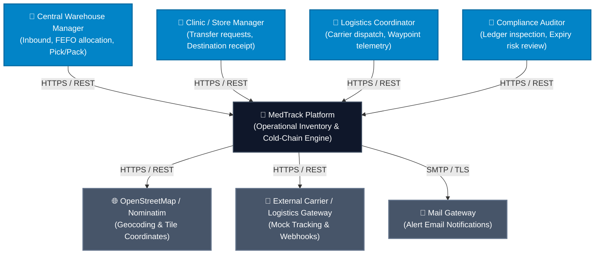
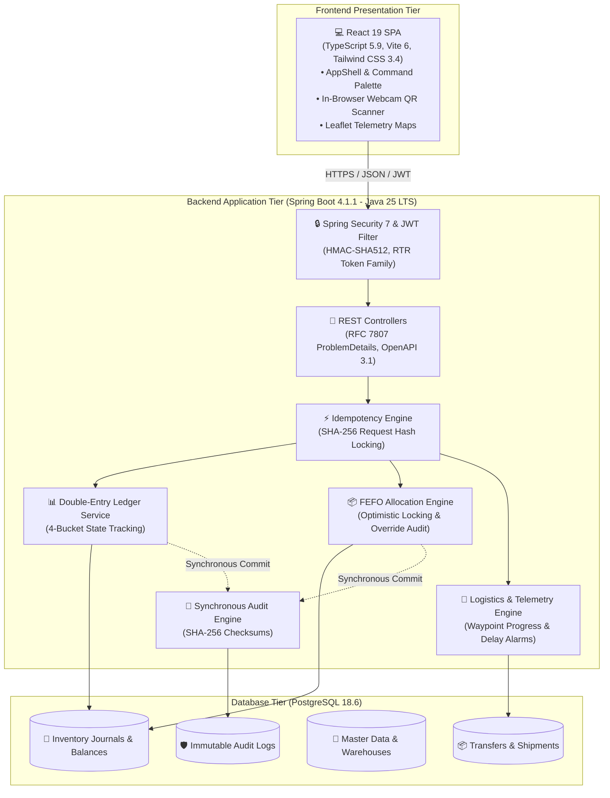
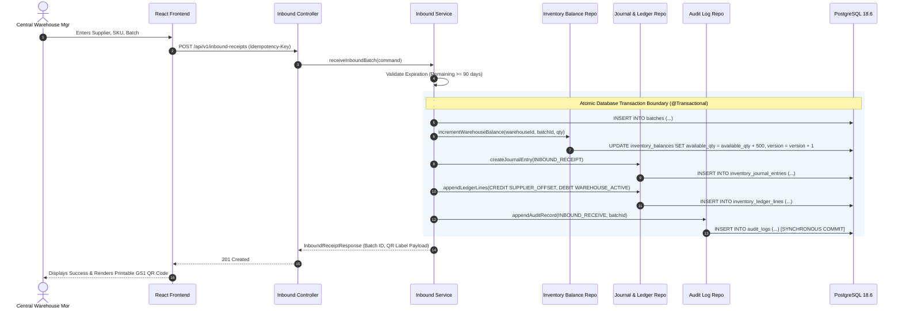
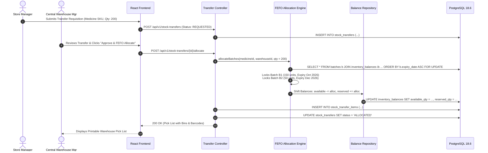
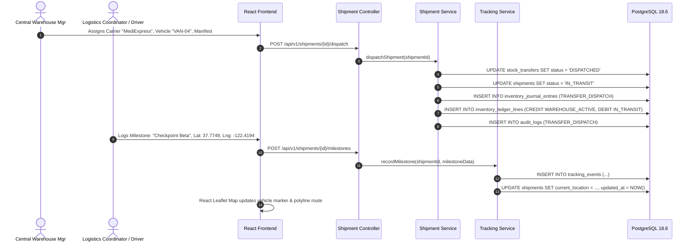
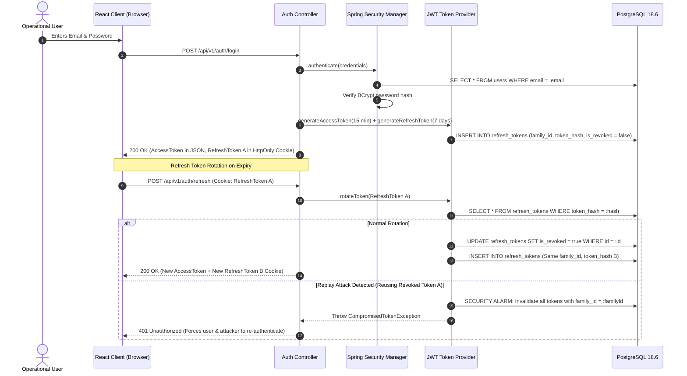
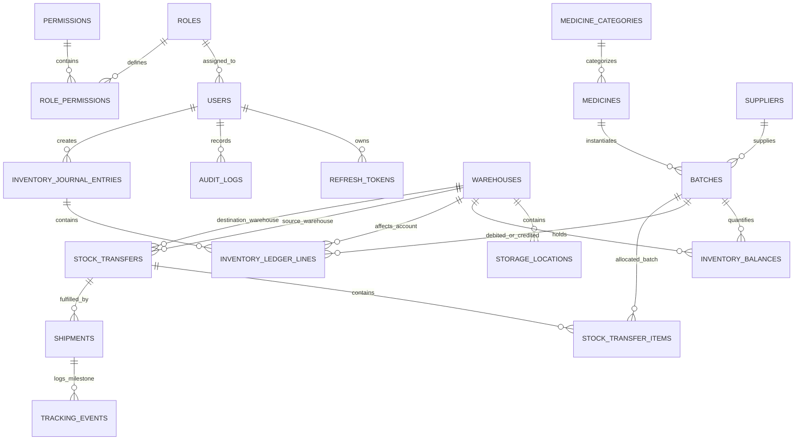

# MedTrack — Comprehensive System Architecture Document

**Document Version:** 2.0.0  
**Status:** Approved & Implemented  
**Target Platform:** MedTrack Enterprise Pharmaceutical Logistics Platform  
**Authors:** MedTrack Systems & Architecture Team  

---

## 📑 Table of Contents

- [1. Executive Architecture Summary & Core Invariants](#1-executive-architecture-summary--core-invariants)
- [2. System Context & C4 Container Architecture](#2-system-context--c4-container-architecture)
  - [2.1 C4 Context Model](#21-c4-context-model)
  - [2.2 C4 Container Model](#22-c4-container-model)
- [3. Domain-Driven Modular Monolith Blueprint](#3-domain-driven-modular-monolith-blueprint)
  - [3.1 Explicit Domain Triad (Transfer → Shipment → Tracking)](#31-explicit-domain-triad-transfer--shipment--tracking)
  - [3.2 Architectural Layering & Separation of Concerns](#32-architectural-layering--separation-of-concerns)
- [4. Double-Entry Inventory Ledger & Mathematical Invariants](#4-double-entry-inventory-ledger--mathematical-invariants)
  - [4.1 Double-Entry Asset Bookkeeping Principles](#41-double-entry-asset-bookkeeping-principles)
  - [4.2 Account Classification Chart](#42-account-classification-chart)
  - [4.3 Multi-Bucket State Transitions](#43-multi-bucket-state-transitions)
  - [4.4 Mathematical Invariants & Optimistic Locking](#44-mathematical-invariants--optimistic-locking)
- [5. Automated FEFO Allocation Engine & Override Guardrails](#5-automated-fefo-allocation-engine--override-guardrails)
  - [5.1 FEFO Sorting & Allocation Algorithm](#51-fefo-sorting--allocation-algorithm)
  - [5.2 Strict Override Auditing Policy](#52-strict-override-auditing-policy)
  - [5.3 Inbound Minimum Shelf-Life Gatekeeping (AC-01)](#53-inbound-minimum-shelf-life-gatekeeping-ac-01)
- [6. Application Lifecycle & Interaction Sequence Diagrams](#6-application-lifecycle--interaction-sequence-diagrams)
  - [6.1 Inbound Consignment Receiving](#61-inbound-consignment-receiving)
  - [6.2 Stock Transfer Request & FEFO Allocation](#62-stock-transfer-request--fe-fo-allocation)
  - [6.3 Shipment Dispatch & Waypoint Telemetry](#63-shipment-dispatch--waypoint-telemetry)
  - [6.4 Stateless JWT Authentication & Refresh Token Rotation (RTR)](#64-stateless-jwt-authentication--refresh-token-rotation-rtr)
- [7. Physical Database Schema & Relational Models](#7-physical-database-schema--relational-models)
  - [7.1 Entity-Relationship Diagram](#71-entity-relationship-diagram)
  - [7.2 Flyway Schema Table Definitions & Indices](#72-flyway-schema-table-definitions--indices)
- [8. Optical Barcodes, GS1 Labeling & Cold-Chain Telemetry](#8-optical-barcodes-gs1-labeling--cold-chain-telemetry)
  - [8.1 GS1 2D QR & 1D Code-128 Specifications](#81-gs1-2d-qr--1d-code-128-specifications)
  - [8.2 Cold-Chain Temperature & Delay Alerting Engine](#82-cold-chain-temperature--delay-alerting-engine)
- [9. Security, RBAC & Token Lifecycle Architecture](#9-security-rbac--token-lifecycle-architecture)
  - [9.1 Token Security & Replay Invalidation](#91-token-security--replay-invalidation)
  - [9.2 Role-Based Access Control (RBAC) Matrix](#92-role-based-access-control-rbac-matrix)
- [10. Error Protocol & RFC 7807 ProblemDetails](#10-error-protocol--rfc-7807-problemdetails)
- [11. Observability, Structured Logging & Synchronous Audit Trail](#11-observability-structured-logging--synchronous-audit-trail)
- [12. Repository Structure & Package Organization](#12-repository-structure--package-organization)
- [13. Architectural Decision Records (ADR) & Tradeoff Matrix](#13-architectural-decision-records-adr--tradeoff-matrix)

---

## 1. Executive Architecture Summary & Core Invariants

MedTrack is an enterprise pharmaceutical inventory management, inter-facility transit orchestration, and cold-chain traceability platform. Built to comply with rigorous healthcare quality standards (**GxP** and **FDA 21 CFR Part 11**), the platform guarantees data integrity, physical batch traceability, and non-repudiation across multi-depot hospital networks.

```text
┌─────────────────────────────────────────────────────────────────────────┐
│                    React 19 + TypeScript 5.9 + Vite 6 SPA               │
│         (Tailwind CSS 3.4, TanStack Query v5, Zustand 5, Leaflet)       │
└────────────────────────────────────┬────────────────────────────────────┘
                                     │ HTTPS / REST (JSON)
                                     ▼
┌─────────────────────────────────────────────────────────────────────────┐
│                  Spring Boot 4.1.1 Core REST API Layer                  │
│               (Java 25 LTS, Spring Security 7.x, JWT RTR)               │
├─────────────────────────────────────────────────────────────────────────┤
│                        Domain Modules / Subsystems                      │
│  ┌──────────────┐  ┌──────────────┐  ┌──────────────┐  ┌──────────────┐ │
│  │   Medicine   │  │    Batch     │  │  Inventory   │  │   Transfer   │ │
│  └──────────────┘  └──────────────┘  └──────────────┘  └──────────────┘ │
│  ┌──────────────┐  ┌──────────────┐  ┌──────────────┐  ┌──────────────┐ │
│  │   Shipment   │  │   Tracking   │  │ Notification │  │    Audit     │ │
│  └──────────────┘  └──────────────┘  └──────────────┘  └──────────────┘ │
├─────────────────────────────────────────────────────────────────────────┤
│        Data Access Layer (Spring Data JPA / Hibernate ORM 7.4.x)        │
└────────────────────────────────────┬────────────────────────────────────┘
                                     │ JDBC / HikariCP
                                     ▼
┌─────────────────────────────────────────────────────────────────────────┐
│                     PostgreSQL 18.6 Relational Engine                   │
│        (ACID Transactions, Double-Entry Ledger, Version Locking)        │
└─────────────────────────────────────────────────────────────────────────┘
```

### Core Architectural Invariants

> [!IMPORTANT]
> The following invariants are strictly enforced at the database schema, domain layer, and API gateway levels:

1. **Deterministic Double-Entry Ledger**: Stock balances are never updated via raw increments (`UPDATE inventory SET qty = qty + X`). Every physical stock movement creates an immutable `inventory_journal_entries` header with balanced `inventory_ledger_lines` credit/debit legs.
2. **First-Expired, First-Out (FEFO) Allocation**: Order reservation algorithms automatically lock the earliest-expiring active batches for a requested formulation. Manual overrides require supervisor credentials, mandatory written rationale, and generate synchronous audit logs.
3. **Dock-Door Minimum Shelf-Life Validation (AC-01)**: Inbound batches with remaining shelf-life less than the medicine's configured threshold (default 90 days) are immediately rejected with an RFC 7807 `422 Unprocessable Entity` response.
4. **Explicit Domain Triad Separation**: Business intent (`StockTransfer`), transportation logistics (`Shipment`), and movement telemetry (`TrackingEvent`) are isolated into distinct domain models.
5. **Synchronous Cryptographic Audit Logging**: Critical security, inventory, and override events are committed in the **exact same database transaction** as the mutation. Failure to record the audit log rolls back the business transaction.
6. **Zero Negative Stock Guarantee**: Database constraints (`CHECK (available_quantity >= 0)`) and optimistic locking (`@Version`) make negative inventory impossible even under high concurrent load.
7. **Single-Use Refresh Token Rotation (RTR)**: Refresh tokens are single-use with cryptographic token family tracking. Reusing a revoked token invalidates the entire session family immediately.

---

## 2. System Context & C4 Container Architecture

### 2.1 C4 Context Model



### 2.2 C4 Container Model



---

## 3. Domain-Driven Modular Monolith Blueprint

### 3.1 Explicit Domain Triad (Transfer → Shipment → Tracking)

MedTrack explicitly models logistics across three distinct domain aggregates to prevent conflation between commercial intent, transportation manifests, and physical sensor telemetry:

```text
┌───────────────────────────┐      ┌───────────────────────────┐      ┌───────────────────────────┐
│       STOCK TRANSFER      │      │         SHIPMENT          │      │      TRACKING EVENT       │
├───────────────────────────┤      ├───────────────────────────┤      ├───────────────────────────┤
│ • Commercial Intent       │─────►│ • Physical Transportation │─────►│ • Physical Sensor / GPS   │
│ • Source & Dest Depots    │      │ • Carrier & Vehicle No.   │      │ • Waypoint Coordinates    │
│ • FEFO Allocated Batches  │      │ • Dispatched Quantities   │      │ • Cold-Chain Temperatures │
│ • State: REQUESTED...     │      │ • State: DISPATCHED...    │      │ • Milestone Timestamps    │
└───────────────────────────┘      └───────────────────────────┘      └───────────────────────────┘
```

1. **Stock Transfer Aggregate (`StockTransfer` & `StockTransferItem`):**
   Captures the requisition intent from a regional dispensary. Handles automated batch allocation, reservation locking, picking, and packing.
2. **Shipment Aggregate (`Shipment` & `ShipmentItem`):**
   Captures the physical custody transfer to a transport carrier. Governs the debit of available warehouse stock into the global `IN_TRANSIT` ledger pool.
3. **Tracking Aggregate (`TrackingEvent`):**
   Captures discrete time-series telemetry events (checkpoints, GPS geofencing, temperature sensor readings, delays) associated with an active shipment.

---

### 3.2 Architectural Layering & Separation of Concerns

```text
┌─────────────────────────────────────────────────────────────────────────┐
│                           CONTROLLER LAYER                              │
│  - Receives HTTP requests, validates DTOs via Bean Validation (@Valid)  │
│  - Zero business logic; delegates execution to Application Services     │
│  - Converts exceptions to RFC 7807 ProblemDetail payloads               │
└────────────────────────────────────┬────────────────────────────────────┘
                                     ▼
┌─────────────────────────────────────────────────────────────────────────┐
│                    APPLICATION SERVICE / USE CASE LAYER                 │
│  - Coordinates cross-domain workflows across entities and repositories │
│  - Manages database transaction boundaries (@Transactional)             │
│  - Evaluates Idempotency keys and invokes synchronous audit recording   │
└────────────────────────────────────┬────────────────────────────────────┘
                                     ▼
┌─────────────────────────────────────────────────────────────────────────┐
│                        DOMAIN ENTITY / SERVICE LAYER                    │
│  - Implements core invariants, FEFO math, and ledger balance rules      │
│  - State machine transitions (TransferStatus, ShipmentStatus)           │
│  - Independent of transport protocols, controllers, or UI models        │
└────────────────────────────────────┬────────────────────────────────────┘
                                     ▼
┌─────────────────────────────────────────────────────────────────────────┐
│                        REPOSITORY / PERSISTENCE LAYER                   │
│  - Spring Data JPA repositories with pessimistic/optimistic locking     │
│  - Flyway managed schema migrations with deterministic indices          │
│  - Native SQL and JPQL projections for streaming CSV reports            │
└─────────────────────────────────────────────────────────────────────────┘
```

---

## 4. Double-Entry Inventory Ledger & Mathematical Invariants

### 4.1 Double-Entry Asset Bookkeeping Principles

Standard single-entry inventory schemas that modify counts in-place suffer from phantom stock updates, race conditions, and an inability to reconcile discrepancies. MedTrack implements **Double-Entry Asset Bookkeeping**:

$$\sum_{L \in \text{Journal}} \text{Debit Quantity} = \sum_{L \in \text{Journal}} \text{Credit Quantity}$$

* **Debit:** Increases stock in the target inventory account (e.g. receiving goods into active storage).
* **Credit:** Decreases stock in the source inventory account (e.g. dispatching goods to transit or supplier offset).

### 4.2 Account Classification Chart

| Account Type | Category | Balance Normal | Description |
| :--- | :--- | :--- | :--- |
| **`WAREHOUSE_ACTIVE`** | Asset | Debit | Physical, usable medication stock located within a warehouse bin. |
| **`IN_TRANSIT`** | Asset | Debit | Medication physically loaded on carrier vehicles in transit. |
| **`QUARANTINE_HOLD`** | Asset | Debit | Stock suspended due to quality holds, recall, or critical expiry ($\le 30\text{d}$). |
| **`SUPPLIER_OFFSET`** | Equity / Contra | Credit | Virtual offset account representing stock introduced from external manufacturers. |
| **`DISPENSE_EXPENSE`**| Expense | Credit | Offset account for stock administered to patients or issued to clinics. |
| **`WRITE_OFF_LOSS`** | Expense | Credit | Offset account for spoiled, expired, or damaged medication write-offs. |
| **`AUDIT_SURPLUS`** | Income | Credit | Offset account for inventory gains identified during physical cycle counts. |

---

### 4.3 Multi-Bucket State Transitions

MedTrack tracks stock across **4 isolated operational buckets** per batch at every facility:

```text
┌──────────────────────────────────────────────────────────────────────────────────────────┐
│                               WAREHOUSE INVENTORY BUCKETS                                │
├──────────────────────────┬──────────────────────────┬────────────────────────────────────┤
│ 1. AVAILABLE             │ 2. RESERVED              │ 3. QUARANTINED                     │
│ Unallocated stock ready  │ Stock locked for an      │ Stock suspended from allocation    │
│ for FEFO allocation      │ approved transfer order  │ (Critical expiry or quality hold)  │
└──────────────────────────┴──────────────────────────┴────────────────────────────────────┘
                                         │
                        [ DISPATCHED TO CARRIER ]
                                         ▼
┌──────────────────────────────────────────────────────────────────────────────────────────┐
│ 4. IN_TRANSIT (Global Inter-Facility Logistics Pool)                                    │
└──────────────────────────────────────────────────────────────────────────────────────────┘
```

### 4.4 Mathematical Invariants & Optimistic Locking

The fast-read aggregate snapshot table `inventory_balances` mirrors ledger states and enforces strict mathematical invariants:

$$\text{Physical On-Hand Quantity} = \text{Available} + \text{Reserved} + \text{Quarantined}$$
$$\text{Available} \ge 0, \quad \text{Reserved} \ge 0, \quad \text{Quarantined} \ge 0$$

Row-level `@Version` optimistic locking guarantees that concurrent picking operations on the same medicine batch will detect collisions and retry or reject cleanly without corrupting inventory counts.

---

## 5. Automated FEFO Allocation Engine & Override Guardrails

### 5.1 FEFO Sorting & Allocation Algorithm

When a transfer request for quantity $Q_{\text{req}}$ of Medicine $M$ is approved at Warehouse $W$:

1. Query active inventory balances for Medicine $M$ in Warehouse $W$ ordered by earliest expiration:
   ```sql
   SELECT ib, b FROM InventoryBalance ib 
   JOIN ib.batch b 
   WHERE ib.warehouse.id = :warehouseId 
     AND b.medicine.id = :medicineId 
     AND b.status = 'ACTIVE' 
     AND b.expiryDate >= CURRENT_DATE 
     AND ib.availableQuantity > 0 
   ORDER BY b.expiryDate ASC, b.id ASC
   FOR UPDATE
   ```
2. The engine iterates through viable batches, allocating $\min(\text{Available Quantity}, Q_{\text{remaining}})$ until $Q_{\text{remaining}} = 0$.
3. If total unreserved quantity is insufficient, the transaction rolls back with a `422 Unprocessable Entity` citing `INSUFFICIENT_STOCK`.
4. For each allocated batch:
   - Decrement `available_quantity -= allocated_qty`
   - Increment `reserved_quantity += allocated_qty`
   - Record allocated batch reference in `stock_transfer_items`.

### 5.2 Strict Override Auditing Policy

> [!WARNING]
> Manual batch allocation overrides are restricted by system policy.

If an operator explicitly bypasses the FEFO suggestion (e.g., selecting a later-expiring batch for a long-distance expedition):
* **Authorized Roles Only:** Permitted strictly for `CENTRAL_WAREHOUSE_MANAGER` and `SUPER_ADMIN`.
* **Mandatory Justification:** The request payload must include a non-empty `override_reason`.
* **Immutable Audit Trail:** Stamps `fefo_overridden = true`, `overridden_by = :userId`, and `overridden_at = NOW()` directly on the transfer item and creates a synchronous high-severity `audit_logs` record.

### 5.3 Inbound Minimum Shelf-Life Gatekeeping (AC-01)

Upon inbound consignment receipt at the warehouse dock:
$$\text{Remaining Days} = \text{Batch Expiry Date} - \text{Current Date}$$

If $\text{Remaining Days} < \text{Medicine.minReceivingShelfLifeDays}$ (default 90 days), the inbound transaction is rejected at the API boundary before ledger entry creation with RFC 7807 status `422 Unprocessable Entity`.

---

## 6. Application Lifecycle & Interaction Sequence Diagrams

### 6.1 Inbound Consignment Receiving



---

### 6.2 Stock Transfer Request & FEFO Allocation



---

### 6.3 Shipment Dispatch & Waypoint Telemetry



---

### 6.4 Stateless JWT Authentication & Refresh Token Rotation (RTR)



---

## 7. Physical Database Schema & Relational Models

### 7.1 Entity-Relationship Diagram



---

### 7.2 Flyway Schema Table Definitions & Indices

#### 1. Master Data (`medicines`, `batches`, `warehouses`, `suppliers`)
```sql
CREATE TABLE medicine_categories (
    id VARCHAR(32) PRIMARY KEY,
    name VARCHAR(100) NOT NULL,
    description TEXT,
    created_at TIMESTAMP WITH TIME ZONE DEFAULT NOW() NOT NULL
);

CREATE TABLE medicines (
    id UUID PRIMARY KEY DEFAULT gen_random_uuid(),
    sku VARCHAR(64) UNIQUE NOT NULL,
    generic_name VARCHAR(255) NOT NULL,
    brand_name VARCHAR(255),
    category_id VARCHAR(32) NOT NULL REFERENCES medicine_categories(id),
    dosage_form VARCHAR(50) NOT NULL,
    strength VARCHAR(64) NOT NULL,
    unit_of_measure VARCHAR(32) NOT NULL,
    storage_temp VARCHAR(32) DEFAULT 'AMBIENT' NOT NULL CHECK (storage_temp IN ('AMBIENT', 'REFRIGERATED', 'FROZEN')),
    min_stock_threshold INT DEFAULT 50 NOT NULL CHECK (min_stock_threshold >= 0),
    min_receiving_shelf_life_days INT DEFAULT 90 NOT NULL CHECK (min_receiving_shelf_life_days >= 0),
    status VARCHAR(20) DEFAULT 'ACTIVE' NOT NULL CHECK (status IN ('ACTIVE', 'DISCONTINUED')),
    created_at TIMESTAMP WITH TIME ZONE DEFAULT NOW() NOT NULL,
    updated_at TIMESTAMP WITH TIME ZONE DEFAULT NOW() NOT NULL
);
CREATE INDEX idx_medicines_sku ON medicines(sku);

CREATE TABLE suppliers (
    id UUID PRIMARY KEY DEFAULT gen_random_uuid(),
    name VARCHAR(255) NOT NULL,
    code VARCHAR(32) UNIQUE NOT NULL,
    contact_email VARCHAR(255),
    contact_phone VARCHAR(64),
    address TEXT,
    created_at TIMESTAMP WITH TIME ZONE DEFAULT NOW() NOT NULL
);

CREATE TABLE batches (
    id UUID PRIMARY KEY DEFAULT gen_random_uuid(),
    batch_number VARCHAR(64) NOT NULL,
    medicine_id UUID NOT NULL REFERENCES medicines(id) ON DELETE RESTRICT,
    supplier_id UUID NOT NULL REFERENCES suppliers(id) ON DELETE RESTRICT,
    manufacturing_date DATE NOT NULL,
    expiry_date DATE NOT NULL,
    initial_quantity INT NOT NULL CHECK (initial_quantity > 0),
    status VARCHAR(20) DEFAULT 'ACTIVE' NOT NULL CHECK (status IN ('ACTIVE', 'QUARANTINED', 'EXPIRED', 'DEPLETED')),
    created_at TIMESTAMP WITH TIME ZONE DEFAULT NOW() NOT NULL,
    updated_at TIMESTAMP WITH TIME ZONE DEFAULT NOW() NOT NULL,
    CONSTRAINT uq_medicine_batch UNIQUE (medicine_id, batch_number),
    CONSTRAINT chk_batch_expiry CHECK (expiry_date > manufacturing_date)
);
CREATE INDEX idx_batches_expiry_status ON batches(expiry_date ASC, status);
```

#### 2. Double-Entry Inventory Ledger Schema
```sql
CREATE TABLE inventory_balances (
    id UUID PRIMARY KEY DEFAULT gen_random_uuid(),
    warehouse_id UUID NOT NULL REFERENCES warehouses(id) ON DELETE RESTRICT,
    batch_id UUID NOT NULL REFERENCES batches(id) ON DELETE RESTRICT,
    storage_location_id UUID REFERENCES storage_locations(id),
    available_quantity INT DEFAULT 0 NOT NULL CHECK (available_quantity >= 0),
    reserved_quantity INT DEFAULT 0 NOT NULL CHECK (reserved_quantity >= 0),
    quarantined_quantity INT DEFAULT 0 NOT NULL CHECK (quarantined_quantity >= 0),
    version BIGINT DEFAULT 0 NOT NULL,
    updated_at TIMESTAMP WITH TIME ZONE DEFAULT NOW() NOT NULL,
    CONSTRAINT uq_warehouse_batch UNIQUE (warehouse_id, batch_id)
);

CREATE TABLE inventory_journal_entries (
    id UUID PRIMARY KEY DEFAULT gen_random_uuid(),
    entry_number VARCHAR(64) UNIQUE NOT NULL,
    entry_type VARCHAR(32) NOT NULL CHECK (entry_type IN (
        'INBOUND_RECEIPT', 'TRANSFER_DISPATCH', 'TRANSFER_RECEIVE', 
        'STOCK_ADJUSTMENT', 'DISPENSE', 'WRITE_OFF', 'QUARANTINE_TRANSFER'
    )),
    reference_entity_type VARCHAR(64),
    reference_entity_id UUID,
    performed_by UUID NOT NULL REFERENCES users(id),
    description TEXT,
    created_at TIMESTAMP WITH TIME ZONE DEFAULT NOW() NOT NULL
);

CREATE TABLE inventory_ledger_lines (
    id UUID PRIMARY KEY DEFAULT gen_random_uuid(),
    journal_entry_id UUID NOT NULL REFERENCES inventory_journal_entries(id) ON DELETE CASCADE,
    batch_id UUID NOT NULL REFERENCES batches(id) ON DELETE RESTRICT,
    account_type VARCHAR(32) NOT NULL CHECK (account_type IN (
        'WAREHOUSE_ACTIVE', 'IN_TRANSIT', 'SUPPLIER_OFFSET', 
        'DISPENSE_EXPENSE', 'WRITE_OFF_LOSS', 'AUDIT_SURPLUS_OFFSET', 'QUARANTINE_HOLD'
    )),
    warehouse_id UUID REFERENCES warehouses(id) ON DELETE RESTRICT,
    direction VARCHAR(8) NOT NULL CHECK (direction IN ('DEBIT', 'CREDIT')),
    quantity INT NOT NULL CHECK (quantity > 0),
    available_delta INT DEFAULT 0 NOT NULL,
    reserved_delta INT DEFAULT 0 NOT NULL,
    quarantined_delta INT DEFAULT 0 NOT NULL,
    created_at TIMESTAMP WITH TIME ZONE DEFAULT NOW() NOT NULL
);
CREATE INDEX idx_ledger_lines_wh_batch ON inventory_ledger_lines(warehouse_id, batch_id, created_at DESC);
  - **Replay / Reuse Detection:** If an already-revoked refresh token is presented, the system flags a token compromise and **instantly revokes all active refresh tokens in that `family_id`**, forcing the attacker and user to re-authenticate.

### 9.2 Authorization Matrix

| Domain Action | Super Admin | Central Wh Mgr | Store Mgr | Logistics | Auditor |
| :--- | :---: | :---: | :---: | :---: | :---: |
| **View Medicine Catalog** | Yes | Yes | Yes | Yes | Yes |
| **Create/Edit Medicine** | Yes | No | No | No | No |
| **Receive Inbound Batch** | Yes | Yes (Central only) | No | No | No |
| **Request Stock Transfer** | Yes | Yes | Yes (Own store) | No | No |
| **Approve & FEFO Allocate**| Yes | Yes (Central only) | No | No | No |
| **Override FEFO (with Reason)**| Yes | Yes (Central only) | No | No | No |
| **Dispatch Shipment** | Yes | Yes (Central only) | No | Yes | No |
| **Log Tracking Milestone** | Yes | No | No | Yes | No |
| **Receive Shipment** | Yes | No | Yes (Own store) | No | No |
| **Adjust Stock / Write-off**| Yes | Yes (with notes) | Yes (with notes)| No | No |
| **View Audit Trail** | Yes | No | No | No | Yes |

---

## 10. API Design & Standard Error Protocol

### 10.1 RESTful Resource Conventions
- All endpoints prefixed with `/api/v1/`.
- Resource nouns in plural lowercase kebab-case: `/api/v1/stock-transfers`, `/api/v1/storage-locations`.
- Query parameters for filtering and pagination: `?page=0&size=20&sort=expiryDate,asc&status=ACTIVE&search=Amoxicillin`.

### 10.2 Standard Error Response (RFC 7807 ProblemDetail)
All error responses return `application/problem+json`:
```json
{
  "type": "https://api.medtrack.internal/errors/insufficient-stock",
  "title": "Insufficient Stock",
  "status": 422,
  "detail": "Requested 200 units of SKU 'MED-ANT-00042', but only 140 units are available in Central Warehouse.",
  "instance": "/api/v1/stock-transfers/018e42b2-8c11-7001-9bc2-3c8172901a1a/allocate",
  "code": "INSUFFICIENT_STOCK",
  "timestamp": "2026-08-26T21:05:00Z",
  "invalidParams": [
    {
      "name": "requested_quantity",
      "reason": "Exceeds available unreserved stock (140)"
    }
  ]
}
```

---

## 11. Observability, Logging, & Synchronous Audit Architecture

### 11.1 Synchronous Transactional Audit Commit Pattern
For critical inventory mutations, FEFO overrides, and security events, audit logging is **committed synchronously within the exact same database transaction boundary**:

```text
Database Transaction (@Transactional)
 ├── 1. Update Inventory Balances (Available, Reserved, Quarantined)
 ├── 2. Append Double-Entry Journal & Ledger Lines (Bucket Deltas)
 └── 3. Insert Critical Audit Record into audit_logs
        ↓
      COMMIT (Atomic Success or Total Rollback)
        ↓
   Asynchronous Event Trigger (@TransactionalEventListener, AFTER_COMMIT)
    ├── Async Email / Push Notifications
    ├── Async Prometheus Metrics & Telemetry
    └── Async WebSocket / SSE Broadcasts
```

This guarantees zero audit blind spots: an inventory mutation cannot succeed if writing its audit record fails.

### 11.2 Structured JSON Logging & MDC Context
1. **Structured JSON Logging:** Logback configured with `logstash-logback-encoder` emitting newline-delimited JSON logs to `stdout`.
2. **Mapped Diagnostic Context (MDC):** Automatically injects context variables into every log entry:
   - `traceId` (UUID generated per request or propagated via `X-Trace-Id`)
   - `userId` (Authenticated user identifier)
   - `userRole` (Role enum)
   - `clientIp` (Origin IP address)
3. **Metrics & Health Probes:** Spring Boot Actuator endpoints enabled:
   - `/actuator/health` (Liveness & Readiness probes for Kubernetes/Docker)
   - `/actuator/prometheus` (Exposes JVM memory, Hikari pool stats, and HTTP latency histograms)

---

## 12. Repository Structure & Package Blueprint

```text
MedTrack/
├── backend/                              # Spring Boot 4.1.1 REST API (Java 25 LTS)
│   ├── src/main/java/com/medtrack/
│   │   ├── audit/                        # Cryptographic audit logging & query repository
│   │   ├── auth/                         # JWT security, token rotation, RBAC, credentials
│   │   ├── batch/                        # Batch entity, expiry calculation, batch controller
│   │   ├── common/                       # ProblemDetail RFC 7807, exceptions, pagination
│   │   ├── config/                       # SecurityConfig, OpenAPI, Jackson, Async config
│   │   ├── idempotency/                  # Idempotency token repository & SHA-256 verification
│   │   ├── inventory/                    # Double-entry ledger, balance snapshot, inbound dock
│   │   ├── masterdata/                   # Medicines, categories, storage bins, suppliers
│   │   ├── notification/                 # Expiry & shipment delay alert workers
│   │   ├── report/                       # CSV streaming exporters & expiry risk queries
│   │   ├── shipment/                     # Carrier dispatch, shipment manifest, receiving
│   │   ├── tracking/                     # Waypoint telemetry, milestones, ZXing barcodes
│   │   ├── transfer/                     # Stock transfers & automated FEFO allocation
│   │   ├── user/                         # User accounts, roles, and warehouse assignments
│   │   └── warehouse/                    # Central warehouse & regional store management
│   ├── src/main/resources/
│   │   ├── db/migration/                 # Flyway migrations V1 to V7
│   │   ├── application.yml               # Base configuration and environment variables
│   │   ├── application-dev.yml           # Dev profile configuration
│   │   └── logback-spring.xml            # Structured JSON logback config
│   ├── pom.xml                           # Maven dependencies & build plugins
│   └── Dockerfile                        # Multi-stage JDK 25 container build
│
├── frontend/                             # React 19 + TypeScript SPA (Vite 6)
│   ├── src/
│   │   ├── components/                   # AppShell, CommandPalette, StatusBadge, Feedback
│   │   ├── features/                     # Feature modules (auth, dashboard, inventory,
│   │   │                                 # master-data, operations, reports, tracking)
│   │   ├── services/                     # Typed Axios client & TanStack Query hooks
│   │   ├── store/                        # Zustand stores (uiStore, authState)
│   │   ├── styles/                       # Design tokens, CSS custom properties, Tailwind
│   │   ├── types/                        # TypeScript DTO interfaces and models
│   │   ├── utils/                        # Formatters, errors, date calculations
│   │   ├── App.tsx                       # Route definitions and RBAC route gates
│   │   └── main.tsx                      # React root entrypoint
│   ├── e2e/                              # Playwright End-to-End Test Suite (15 specs)
│   ├── index.html
│   ├── package.json
│   ├── tsconfig.json
│   └── vite.config.ts
│
├── docs/                                 # Full Architectural Documentation
│   ├── architecture.md                   # System Architecture & C4 Models
│   ├── prd.md                            # Product Requirements Document
│   ├── roadmap.md                        # Implementation Roadmap & Phased Execution Plan
│   ├── design.md                         # Design System & Token Specifications
│   ├── rules.md                          # Engineering Invariants & Coding Rules
│   ├── database/erd.md                   # Visual Schema ERD & Table DDL
│   └── decisions/ADR-001...              # Architecture Decision Records
│
├── infra/                                # Infrastructure & Containerization
│   └── docker-compose.yml                # Multi-container orchestration
│
├── .github/workflows/
│   └── ci.yml                            # Automated CI/CD Pipeline
├── .env.example                          # Environment configuration template
├── DEPLOYMENT.md                         # Production & Cloud deployment guide
└── README.md                             # Project repository homepage
```

---

## 13. Architectural Decision Records (ADR) & Tradeoff Matrix

| Architecture Decision | Chosen Approach | Alternative Considered | Engineering Rationale & Tradeoff |
| :--- | :--- | :--- | :--- |
| **System Architectural Style** | Modular Monolith | Microservices, Serverless | Provides single-transaction ACID guarantees across inventory ledgers with zero network hop latency and low operational overhead. |
| **Persistence Engine** | PostgreSQL 18.6 | MySQL, MongoDB | PostgreSQL delivers reliable serializable isolation, native JSONB for audit diffs, and generated column index support. |
| **Inventory Accounting** | Double-Entry Journal + Aggregate Snapshot | Single-Entry Mutable Columns | Double-entry asset accounting ensures balanced $\sum \text{Debits} = \sum \text{Credits}$, tracks goods in transit on the balance sheet, and eliminates silent stock corruption. |
| **Batch Allocation** | Enforced FEFO | FIFO, Manual Picking | FEFO directly targets pharmaceutical expiration reduction, saving an estimated 15–25% in clinical drug spoilage. |
| **Mapping & Telemetry** | Leaflet + OpenStreetMap | Google Maps Platform | OpenStreetMap + Leaflet is open-source, cost-free, self-hostable, and avoids third-party API key billing dependencies. |
| **Client State Management** | TanStack Query v5 + Zustand 5 | Redux Toolkit | TanStack Query provides robust server-state caching, background refetching, and automatic mutation invalidation with minimal boilerplate. |
| **Security & Session RTR** | Stateless JWT + Refresh Token Rotation | Stateful Sessions / Redis | Stateless JWT allows horizontal scaling while database-backed single-use RTR provides instant replay attack defense and session revocation. |

---

<div align="center">
  <sub>MedTrack Architectural Blueprint • Compliant with GxP & FDA 21 CFR Part 11 Standards</sub>
</div>

