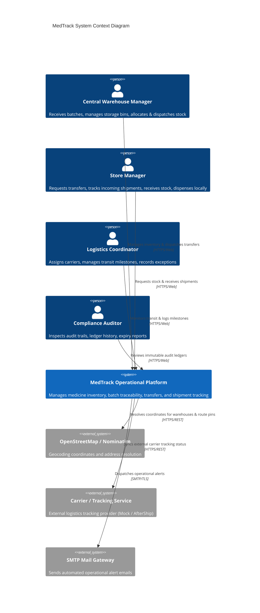
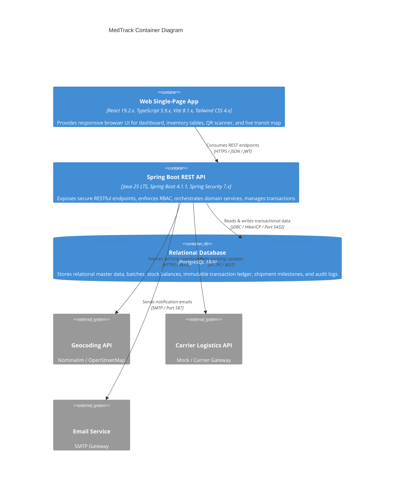
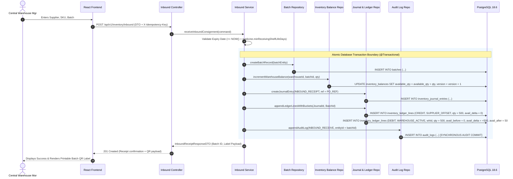
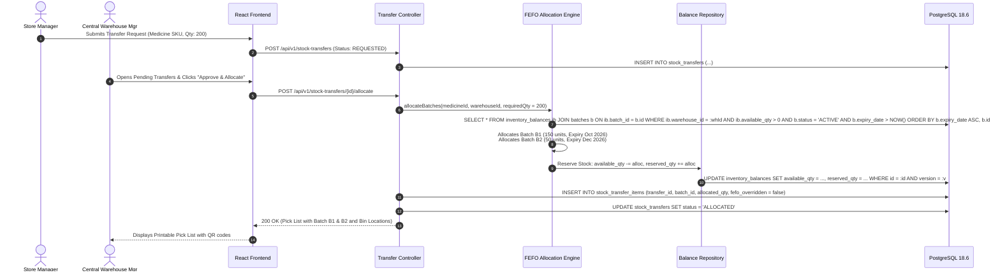
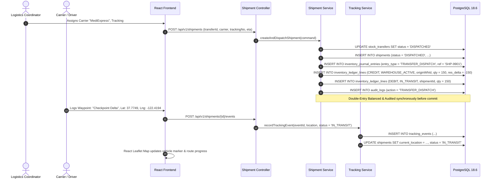
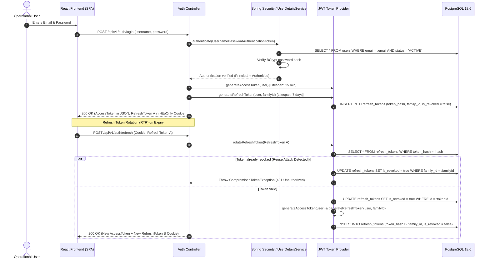
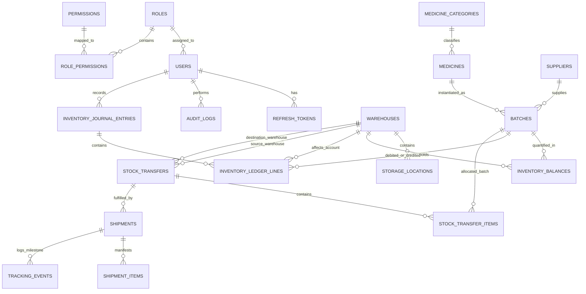

# MedTrack — System Architecture Document

**Document Version:** 1.0.0  
**Status:** Approved for Implementation  
**Target System:** MedTrack Operational Platform (Web)  
**Author:** MedTrack Systems & Architecture Team  

---

## 1. Architecture Overview & Core Principles

MedTrack is architected as a **Modular Monolith** using **Spring Boot 4.1.1 (Java 25 LTS)** and **PostgreSQL 18.6**, paired with a **React 19.2.x / TypeScript 5.9.x / Vite 8.1.x** single-page application (SPA).

```text
┌─────────────────────────────────────────────────────────────────────────┐
│                    React 19.2.x + TypeScript 5.9.x SPA                  │
│             (Vite 8.1.x, Tailwind CSS 4.x, TanStack Query, Leaflet)     │
└────────────────────────────────────┬────────────────────────────────────┘
                                     │ HTTPS / REST (JSON)
                                     ▼
┌─────────────────────────────────────────────────────────────────────────┐
│                    Spring Boot 4.1.1 REST API Layer                     │
│                  (Spring Security 7.x, Stateless JWT)                   │
├─────────────────────────────────────────────────────────────────────────┤
│                         Domain Modules / Use Cases                      │
│  ┌──────────────┐  ┌──────────────┐  ┌──────────────┐  ┌──────────────┐ │
│  │   Medicine   │  │    Batch     │  │  Inventory   │  │   Transfer   │ │
│  └──────────────┘  └──────────────┘  └──────────────┘  └──────────────┘ │
│  ┌──────────────┐  ┌──────────────┐  ┌──────────────┐  ┌──────────────┐ │
│  │   Shipment   │  │   Tracking   │  │ Notification │  │    Audit     │ │
│  └──────────────┘  └──────────────┘  └──────────────┘  └──────────────┘ │
├─────────────────────────────────────────────────────────────────────────┤
│        Data Access Layer (Spring Data JPA / Hibernate ORM 7.4.x)        │
└────────────────────────────────────┬────────────────────────────────────┘
                                     │ JDBC / HikariCP
                                     ▼
┌─────────────────────────────────────────────────────────────────────────┐
│                     PostgreSQL 18.6 Database Engine                     │
│        (ACID Transactions, Double-Entry Ledger, Version Locking)        │
└─────────────────────────────────────────────────────────────────────────┘
```

### Core Architecture Principles
1. **Domain-Driven Modular Boundaries:** Each business capability (Medicine, Batch, Inventory, Transfer, Shipment, Tracking) is encapsulated in a dedicated package. Cross-domain interactions occur strictly through public service interfaces or domain events.
2. **Explicit Domain Triad (Transfer → Shipment → Tracking):**
   - **Transfer (Business Intent):** Request, approval, and FEFO inventory allocation between warehouses.
   - **Shipment (Physical Transportation):** Carrier assignment, tracking number, vehicle manifest, and dispatch lifecycle.
   - **Tracking (Movement Telemetry):** Milestone checkpoints, GPS coordinates, delay exceptions, and route visualization.
3. **Deterministic Double-Entry Inventory Ledger with 3-Bucket Tracking:** Stock is never mutated via raw arithmetic updates on single records. Every inventory movement generates a balanced **Double-Entry Journal Entry** (`inventory_journal_entries`) with paired **Debit and Credit Ledger Lines** (`inventory_ledger_lines`) tracking explicit deltas across `available`, `reserved`, and `quarantined` buckets, synchronizing an optimistic-locked balance snapshot in `inventory_balances`.
4. **FEFO by Design with Strict Override Auditing:** Batch selection algorithms enforce First-Expired, First-Out picking by default. Manual overrides require mandatory supervisor justification and generate synchronous audit log records.
5. **Configurable Receiving Policies:** Inbound batch expiration thresholds are configurable per medicine (`min_receiving_shelf_life_days`) and via system defaults rather than rigid hardcoded constants.
6. **First-Class Mock & Pluggable Provider Architecture:** Geocoding, shipment tracking, and email notifications sit behind decoupled interfaces with production-grade Mock providers enabling frictionless zero-dependency local development.
7. **Synchronous Audit Trail for Critical Mutations:** Core inventory and security events are committed in the same database transaction as the business mutation, while external notifications and analytics execute asynchronously.
8. **Fail-Safe Concurrency & Idempotency:** Optimistic locking (`@Version`) prevents lost updates during concurrent operations, and `X-Idempotency-Key` headers prevent duplicate execution of critical commands.

---

## 2. System Context & C4 Container Architecture

### 2.1 C4 Context Diagram (Mermaid)



### 2.2 C4 Container Diagram (Mermaid)



---

## 3. Application Flow & Sequence Diagrams

### 3.1 Inbound Consignment Receiving Sequence



### 3.2 Stock Transfer & FEFO Allocation Sequence



### 3.3 Shipment Dispatch & Transit Tracking Sequence



### 3.4 Stateless JWT Authentication & Refresh Token Rotation (RTR) Sequence



---

## 4. Repository & Project Directory Structure

```text
MedTrack/
├── backend/
│   ├── src/
│   │   ├── main/
│   │   │   ├── java/
│   │   │   │   └── com/
│   │   │   │       └── medtrack/
│   │   │   │           ├── MedTrackApplication.java
│   │   │   │           │
│   │   │   │           ├── auth/                     # Authentication & Token Management
│   │   │   │           │   ├── controller/           # AuthController (login, refresh, logout)
│   │   │   │           │   ├── dto/                  # LoginRequest, AuthResponse, TokenRefreshDTO
│   │   │   │           │   ├── entity/               # RefreshTokenEntity
│   │   │   │           │   ├── repository/           # RefreshTokenRepository
│   │   │   │           │   ├── security/             # JwtFilter, JwtProvider, CustomUserDetailsService
│   │   │   │           │   └── service/              # AuthService
│   │   │   │           │
│   │   │   │           ├── user/                     # Users, Roles, Permissions
│   │   │   │           │   ├── controller/           # UserController, RoleController
│   │   │   │           │   ├── dto/                  # UserDTO, CreateUserRequest, RoleDTO
│   │   │   │           │   ├── entity/               # User, Role, Permission
│   │   │   │           │   ├── repository/           # UserRepository, RoleRepository
│   │   │   │           │   └── service/              # UserService
│   │   │   │           │
│   │   │   │           ├── medicine/                 # Medicines & Categories
│   │   │   │           │   ├── controller/           # MedicineController, CategoryController
│   │   │   │           │   ├── dto/                  # MedicineRequestDTO, MedicineResponseDTO
│   │   │   │           │   ├── entity/               # Medicine, MedicineCategory
│   │   │   │           │   ├── repository/           # MedicineRepository, CategoryRepository
│   │   │   │           │   └── service/              # MedicineService
│   │   │   │           │
│   │   │   │           ├── batch/                    # Batch & Expiry Management
│   │   │   │           │   ├── controller/           # BatchController
│   │   │   │           │   ├── dto/                  # BatchCreateDTO, BatchResponseDTO, ExpirySummaryDTO
│   │   │   │           │   ├── entity/               # Batch (batchNumber, mfgDate, expDate, status)
│   │   │   │           │   ├── repository/           # BatchRepository
│   │   │   │           │   └── service/              # BatchService, ExpiryCalculationService
│   │   │   │           │
│   │   │   │           ├── warehouse/                # Central Warehouse & Store Master
│   │   │   │           │   ├── controller/           # WarehouseController, LocationController
│   │   │   │           │   ├── dto/                  # WarehouseDTO, StorageLocationDTO
│   │   │   │           │   ├── entity/               # Warehouse, StorageLocation
│   │   │   │           │   ├── repository/           # WarehouseRepository, StorageLocationRepository
│   │   │   │           │   └── service/              # WarehouseService
│   │   │   │           │
│   │   │   │           ├── supplier/                 # Supplier Profiles & Catalog
│   │   │   │           │   ├── controller/           # SupplierController
│   │   │   │           │   ├── dto/                  # SupplierDTO, SupplierCreateRequest
│   │   │   │           │   ├── entity/               # Supplier
│   │   │   │           │   ├── repository/           # SupplierRepository
│   │   │   │           │   └── service/              # SupplierService
│   │   │   │           │
│   │   │   │           ├── inventory/                # Stock Balances, Double-Entry Journal & Adjustments
│   │   │   │           │   ├── controller/           # InventoryController, JournalController
│   │   │   │           │   ├── dto/                  # StockBalanceDTO, AdjustmentRequestDTO, InboundDTO, JournalEntryDTO
│   │   │   │           │   ├── entity/               # InventoryBalance, InventoryJournalEntry, InventoryLedgerLine
│   │   │   │           │   ├── repository/           # InventoryBalanceRepository, JournalEntryRepository, LedgerLineRepository
│   │   │   │           │   └── service/              # InventoryService, InboundService, DoubleEntryLedgerService
│   │   │   │           │
│   │   │   │           ├── transfer/                 # Inter-Store Stock Transfers & FEFO
│   │   │   │           │   ├── controller/           # TransferController
│   │   │   │           │   ├── dto/                  # TransferRequestDTO, TransferResponseDTO, PickListDTO
│   │   │   │           │   ├── entity/               # StockTransfer, StockTransferItem
│   │   │   │           │   ├── repository/           # StockTransferRepository, TransferItemRepository
│   │   │   │           │   └── service/              # TransferService, FefoAllocationEngine
│   │   │   │           │
│   │   │   │           ├── shipment/                 # Shipment & Carrier Lifecycle
│   │   │   │           │   ├── controller/           # ShipmentController
│   │   │   │           │   ├── dto/                  # ShipmentCreateDTO, ShipmentResponseDTO
│   │   │   │           │   ├── entity/               # Shipment, ShipmentItem
│   │   │   │           │   ├── repository/           # ShipmentRepository, ShipmentItemRepository
│   │   │   │           │   └── service/              # ShipmentService
│   │   │   │           │
│   │   │   │           ├── tracking/                 # Milestone Events & Map Geolocation
│   │   │   │           │   ├── controller/           # TrackingController
│   │   │   │           │   ├── dto/                  # TrackingEventDTO, RouteCoordinatesDTO
│   │   │   │           │   ├── entity/               # TrackingEvent
│   │   │   │           │   ├── repository/           # TrackingEventRepository
│   │   │   │           │   ├── provider/             # ShipmentTrackingProvider, MockProvider, AfterShipAdapter
│   │   │   │           │   └── service/              # TrackingService, GeocodingService
│   │   │   │           │
│   │   │   │           ├── notification/             # Operational Alerts & Email
│   │   │   │           │   ├── controller/           # NotificationController
│   │   │   │           │   ├── dto/                  # NotificationDTO
│   │   │   │           │   ├── entity/               # Notification
│   │   │   │           │   ├── repository/           # NotificationRepository
│   │   │   │           │   └── service/              # NotificationService, EmailAlertService
│   │   │   │           │
│   │   │   │           ├── report/                   # Reports & Analytics
│   │   │   │           │   ├── controller/           # ReportController
│   │   │   │           │   ├── dto/                  # InventorySummaryDTO, ExpiryReportDTO, SlaMetricsDTO
│   │   │   │           │   └── service/              # ReportService, CsvExportService
│   │   │   │           │
│   │   │   │           ├── audit/                    # Global Immutable Audit Trail
│   │   │   │           │   ├── entity/               # AuditLog
│   │   │   │           │   ├── repository/           # AuditLogRepository
│   │   │   │           │   └── service/              # AuditService, EntityAuditListener
│   │   │   │           │
│   │   │   │           └── shared/                   # Cross-Cutting Concerns
│   │   │   │               ├── config/               # SecurityConfig, CorsConfig, OpenApiConfig, JpaConfig
│   │   │   │               ├── exception/            # MedTrackException, GlobalExceptionHandler, ProblemDetail
│   │   │   │               ├── filter/               # IdempotencyFilter, MDCLoggingFilter
│   │   │   │               ├── util/                 # BarcodeGenerator, DateUtils, PagingUtils
│   │   │   │               └── model/                # BaseEntity, IdempotencyKey
│   │   │   │
│   │   │   └── resources/
│   │   │       ├── db/migration/                     # Flyway SQL Scripts (V1__init.sql, V2__seed.sql, etc.)
│   │   │       ├── application.yml                   # Spring Boot Base Configuration
│   │   │       ├── application-dev.yml               # Dev Profile Configuration
│   │   │       ├── application-prod.yml              # Production Profile Configuration
│   │   │       └── logback-spring.xml                # Structured JSON Logback Configuration
│   │   │
│   │   └── test/
│   │       └── java/com/medtrack/                    # Unit, Slice, and Testcontainers Integration Tests
│   ├── pom.xml                                       # Maven Dependencies & Build Plugins
│   └── Dockerfile                                    # Multi-stage Eclipse Temurin 21 Dockerfile
│
├── frontend/
│   ├── src/
│   │   ├── assets/                                   # Logos, static illustrations
│   │   ├── components/                               # Shared atomic & molecular UI components
│   │   │   ├── ui/                                   # Button, Input, Table, Badge, Modal, Card, Toast
│   │   │   ├── layout/                               # AppShell, Sidebar, Topbar, PageHeader
│   │   │   ├── feedback/                             # Skeleton, EmptyState, ErrorBanner, LoadingSpinner
│   │   │   └── scanner/                              # QrScannerModal, BarcodeWedgeListener
│   │   │
│   │   ├── features/                                 # Domain-specific feature modules
│   │   │   ├── auth/                                 # LoginPage, AuthContext, ProtectedRoute
│   │   │   ├── dashboard/                            # KpiCards, ExpiryWidget, RecentTransfersTable
│   │   │   ├── medicines/                            # MedicineList, MedicineDetailModal, MedicineForm
│   │   │   ├── batches/                              # BatchListTable, BatchHealthBadge, QrLabelModal
│   │   │   ├── inventory/                            # StockBalanceTable, InboundReceiptForm, AdjustStockModal
│   │   │   ├── transfers/                            # TransferList, TransferStepperWizard, PickListView
│   │   │   ├── shipments/                            # ShipmentList, CreateShipmentModal, DispatchManifest
│   │   │   ├── tracking/                             # LiveTrackingMap, WaypointTimeline, AddEventModal
│   │   │   ├── reports/                              # ExpiryReportView, StockLedgerTable, ExportButton
│   │   │   └── audit/                                # AuditLogViewer, DiscrepancyTable
│   │   │
│   │   ├── hooks/                                    # Custom React hooks (useAuth, useQrScanner, useDebounce)
│   │   ├── services/                                 # Axios API clients with auto-interceptors
│   │   ├── store/                                    # Zustand state stores (warehouseContext, activeUser)
│   │   ├── types/                                    # TypeScript interface models and DTO types
│   │   ├── utils/                                    # Formatters (currency, dates, batch status)
│   │   ├── App.tsx                                   # Root component & React Router route tree
│   │   ├── main.tsx                                  # React 19.2.x DOM mount point
│   │   └── index.css                                 # Tailwind CSS base styles & custom design tokens
│   │
│   ├── index.html                                    # HTML5 Entry point
│   ├── package.json                                  # NPM Dependencies & Scripts
│   ├── tailwind.config.js                            # Design System Colors, Fonts, and Spacing Tokens
│   ├── tsconfig.json                                 # TypeScript compiler configuration
│   ├── vite.config.ts                                # Vite bundler & dev server proxy configuration
│   └── Dockerfile                                    # Multi-stage Nginx Alpine Dockerfile
│
├── infra/
│   ├── docker-compose.yml                            # Local dev stack (Postgres 16, pgAdmin, Backend, Frontend)
│   ├── docker-compose.prod.yml                       # Production deployment stack
│   └── nginx/                                        # Reverse proxy configuration
│       └── default.conf
│
├── docs/                                             # Project architectural diagrams & specs
└── README.md
```

---

## 5. Architectural Layering & Separation of Concerns

```text
┌─────────────────────────────────────────────────────────────────────────┐
│                           CONTROLLER LAYER                              │
│  - Receives HTTP requests, consumes & validates DTOs (@Valid)           │
│  - Never contains business logic; delegates directly to Use Cases       │
│  - Transforms Service results to HTTP Response Entities (RFC 7807)      │
└────────────────────────────────────┬────────────────────────────────────┘
                                     ▼
┌─────────────────────────────────────────────────────────────────────────┐
│                    APPLICATION SERVICE / USE CASE LAYER                 │
│  - Coordinates domain workflows across repositories and external clients│
│  - Manages database transaction boundaries (@Transactional)             │
│  - Enforces idempotency checks and orchestrates audit log publishing    │
└────────────────────────────────────┬────────────────────────────────────┘
                                     ▼
┌─────────────────────────────────────────────────────────────────────────┐
│                        DOMAIN ENTITY / SERVICE LAYER                    │
│  - Contains core domain invariants and business calculations (e.g. FEFO)│
│  - Enforces entity lifecycle state transitions                          │
│  - Pure domain rules without HTTP or serialization dependencies         │
└────────────────────────────────────┬────────────────────────────────────┘
                                     ▼
┌─────────────────────────────────────────────────────────────────────────┐
│                        REPOSITORY / PERSISTENCE LAYER                   │
│  - Spring Data JPA Repositories executing SQL queries & JPQL            │
│  - Handles database pessimistic/optimistic locking                      │
│  - Returns managed JPA entities or optimized read projections           │
└─────────────────────────────────────────────────────────────────────────┘
```

### Layering Prohibitions
- **Controllers must NOT:** Query JPA repositories directly, contain SQL or JPQL, throw raw unhandled exceptions, or mutate database state without calling a service.
- **DTOs must NOT:** Reference JPA entities directly (preventing lazy-loading exceptions and serialization leaks).
- **Entities must NOT:** Reference HTTP request contexts, Spring Security contexts, or frontend DTO classes.
- **Repositories must NOT:** Contain business calculation rules; their sole responsibility is data persistence and retrieval.

---

## 6. Database Architecture & Relational Schema

### 6.1 Entity-Relationship Diagram (Mermaid)



### 6.2 Table Definitions & Schema Constraints

#### 1. `users` & `roles`
```sql
CREATE TABLE roles (
    id VARCHAR(32) PRIMARY KEY, -- 'SUPER_ADMIN', 'CENTRAL_WAREHOUSE_MANAGER', 'STORE_MANAGER', 'LOGISTICS_COORDINATOR', 'AUDITOR'
    description VARCHAR(255) NOT NULL,
    created_at TIMESTAMP WITH TIME ZONE DEFAULT NOW() NOT NULL
);

CREATE TABLE permissions (
    id VARCHAR(64) PRIMARY KEY, -- e.g. 'INVENTORY_ADJUST', 'TRANSFER_APPROVE', 'BATCH_CREATE'
    description VARCHAR(255) NOT NULL
);

CREATE TABLE role_permissions (
    role_id VARCHAR(32) REFERENCES roles(id) ON DELETE CASCADE,
    permission_id VARCHAR(64) REFERENCES permissions(id) ON DELETE CASCADE,
    PRIMARY KEY (role_id, permission_id)
);

CREATE TABLE users (
    id UUID PRIMARY KEY DEFAULT gen_random_uuid(),
    email VARCHAR(255) UNIQUE NOT NULL,
    password_hash VARCHAR(255) NOT NULL,
    full_name VARCHAR(128) NOT NULL,
    role_id VARCHAR(32) NOT NULL REFERENCES roles(id),
    assigned_warehouse_id UUID, -- NULL for global roles (SUPER_ADMIN, AUDITOR, LOGISTICS)
    status VARCHAR(20) DEFAULT 'ACTIVE' NOT NULL CHECK (status IN ('ACTIVE', 'INACTIVE', 'SUSPENDED')),
    created_at TIMESTAMP WITH TIME ZONE DEFAULT NOW() NOT NULL,
    updated_at TIMESTAMP WITH TIME ZONE DEFAULT NOW() NOT NULL
);

CREATE TABLE refresh_tokens (
    id UUID PRIMARY KEY DEFAULT gen_random_uuid(),
    user_id UUID NOT NULL REFERENCES users(id) ON DELETE CASCADE,
    token_hash VARCHAR(255) UNIQUE NOT NULL,
    family_id UUID NOT NULL, -- Token family identifier for Refresh Token Rotation (RTR)
    is_revoked BOOLEAN DEFAULT FALSE NOT NULL,
    replaced_by_token_id UUID,
    expires_at TIMESTAMP WITH TIME ZONE NOT NULL,
    created_at TIMESTAMP WITH TIME ZONE DEFAULT NOW() NOT NULL
);
CREATE INDEX idx_refresh_token_hash ON refresh_tokens(token_hash);
CREATE INDEX idx_refresh_family ON refresh_tokens(family_id);
```

#### 2. `medicines` & `batches`
```sql
CREATE TABLE medicine_categories (
    id VARCHAR(32) PRIMARY KEY, -- 'ANTIBIOTIC', 'ANALGESIC', 'CARDIOVASCULAR', 'VACCINE', etc.
    name VARCHAR(100) NOT NULL,
    description TEXT,
    created_at TIMESTAMP WITH TIME ZONE DEFAULT NOW() NOT NULL
);

CREATE TABLE medicines (
    id UUID PRIMARY KEY DEFAULT gen_random_uuid(),
    sku VARCHAR(64) UNIQUE NOT NULL, -- e.g. 'MED-ANT-00042'
    generic_name VARCHAR(255) NOT NULL,
    brand_name VARCHAR(255),
    category_id VARCHAR(32) NOT NULL REFERENCES medicine_categories(id),
    dosage_form VARCHAR(50) NOT NULL, -- 'TABLET', 'SYRUP', 'INJECTION', 'CAPSULE', 'VIAL'
    strength VARCHAR(64) NOT NULL,    -- '500mg', '10mg/ml'
    unit_of_measure VARCHAR(32) NOT NULL, -- 'BOX', 'BOTTLE', 'VIAL', 'BLISTER'
    storage_temp VARCHAR(32) DEFAULT 'AMBIENT' NOT NULL CHECK (storage_temp IN ('AMBIENT', 'REFRIGERATED', 'FROZEN')),
    min_stock_threshold INT DEFAULT 50 NOT NULL CHECK (min_stock_threshold >= 0),
    min_receiving_shelf_life_days INT DEFAULT 90 NOT NULL CHECK (min_receiving_shelf_life_days >= 0),
    status VARCHAR(20) DEFAULT 'ACTIVE' NOT NULL CHECK (status IN ('ACTIVE', 'DISCONTINUED')),
    created_at TIMESTAMP WITH TIME ZONE DEFAULT NOW() NOT NULL,
    updated_at TIMESTAMP WITH TIME ZONE DEFAULT NOW() NOT NULL
);
CREATE INDEX idx_medicines_sku ON medicines(sku);
CREATE INDEX idx_medicines_category ON medicines(category_id);

CREATE TABLE suppliers (
    id UUID PRIMARY KEY DEFAULT gen_random_uuid(),
    name VARCHAR(255) NOT NULL,
    code VARCHAR(32) UNIQUE NOT NULL, -- 'SUP-PFIZER', 'SUP-NOVARTIS'
    contact_email VARCHAR(255),
    contact_phone VARCHAR(64),
    address TEXT,
    created_at TIMESTAMP WITH TIME ZONE DEFAULT NOW() NOT NULL
);

CREATE TABLE batches (
    id UUID PRIMARY KEY DEFAULT gen_random_uuid(),
    batch_number VARCHAR(64) NOT NULL,
    medicine_id UUID NOT NULL REFERENCES medicines(id) ON DELETE RESTRICT,
    supplier_id UUID NOT NULL REFERENCES suppliers(id) ON DELETE RESTRICT,
    manufacturing_date DATE NOT NULL,
    expiry_date DATE NOT NULL,
    initial_quantity INT NOT NULL CHECK (initial_quantity > 0),
    status VARCHAR(20) DEFAULT 'ACTIVE' NOT NULL CHECK (status IN ('ACTIVE', 'QUARANTINED', 'EXPIRED', 'DEPLETED')),
    created_at TIMESTAMP WITH TIME ZONE DEFAULT NOW() NOT NULL,
    updated_at TIMESTAMP WITH TIME ZONE DEFAULT NOW() NOT NULL,
    CONSTRAINT uq_medicine_batch UNIQUE (medicine_id, batch_number),
    CONSTRAINT chk_batch_expiry CHECK (expiry_date > manufacturing_date)
);
CREATE INDEX idx_batches_expiry_status ON batches(expiry_date ASC, status);
CREATE INDEX idx_batches_medicine ON batches(medicine_id);
```

#### 3. `warehouses` & `inventory_balances` (Double-Entry Mechanics)
```sql
CREATE TABLE warehouses (
    id UUID PRIMARY KEY DEFAULT gen_random_uuid(),
    code VARCHAR(32) UNIQUE NOT NULL, -- 'CW-01', 'STORE-NORTH', 'STORE-EAST'
    name VARCHAR(128) NOT NULL,
    type VARCHAR(32) NOT NULL CHECK (type IN ('CENTRAL_WAREHOUSE', 'DISTRIBUTION_STORE')),
    address TEXT NOT NULL,
    latitude NUMERIC(10, 7),
    longitude NUMERIC(10, 7),
    contact_phone VARCHAR(64),
    status VARCHAR(20) DEFAULT 'ACTIVE' NOT NULL CHECK (status IN ('ACTIVE', 'INACTIVE')),
    created_at TIMESTAMP WITH TIME ZONE DEFAULT NOW() NOT NULL
);

CREATE TABLE storage_locations (
    id UUID PRIMARY KEY DEFAULT gen_random_uuid(),
    warehouse_id UUID NOT NULL REFERENCES warehouses(id) ON DELETE CASCADE,
    zone VARCHAR(32) NOT NULL,  -- 'ZONE-A'
    rack VARCHAR(32) NOT NULL,  -- 'RACK-03'
    shelf VARCHAR(32) NOT NULL, -- 'SHELF-02'
    bin_code VARCHAR(64) NOT NULL, -- 'CW01-A-03-02'
    UNIQUE(warehouse_id, bin_code)
);

CREATE TABLE inventory_balances (
    id UUID PRIMARY KEY DEFAULT gen_random_uuid(),
    warehouse_id UUID NOT NULL REFERENCES warehouses(id) ON DELETE RESTRICT,
    batch_id UUID NOT NULL REFERENCES batches(id) ON DELETE RESTRICT,
    storage_location_id UUID REFERENCES storage_locations(id),
    available_quantity INT DEFAULT 0 NOT NULL CHECK (available_quantity >= 0),
    reserved_quantity INT DEFAULT 0 NOT NULL CHECK (reserved_quantity >= 0),
    quarantined_quantity INT DEFAULT 0 NOT NULL CHECK (quarantined_quantity >= 0),
    version BIGINT DEFAULT 0 NOT NULL, -- Optimistic locking field
    updated_at TIMESTAMP WITH TIME ZONE DEFAULT NOW() NOT NULL,
    CONSTRAINT uq_warehouse_batch UNIQUE (warehouse_id, batch_id)
);
CREATE INDEX idx_inv_balances_lookup ON inventory_balances(warehouse_id, batch_id);

-- True Double-Entry Inventory Journal (Header)
CREATE TABLE inventory_journal_entries (
    id UUID PRIMARY KEY DEFAULT gen_random_uuid(),
    entry_number VARCHAR(64) UNIQUE NOT NULL, -- e.g. 'JRN-2026-000842'
    entry_type VARCHAR(32) NOT NULL CHECK (entry_type IN (
        'INBOUND_RECEIPT', 'TRANSFER_DISPATCH', 'TRANSFER_RECEIVE', 
        'STOCK_ADJUSTMENT', 'DISPENSE', 'WRITE_OFF', 'QUARANTINE_TRANSFER'
    )),
    reference_entity_type VARCHAR(64), -- 'STOCK_TRANSFER', 'SHIPMENT', 'PURCHASE_ORDER', 'ADJUSTMENT'
    reference_entity_id UUID,
    performed_by UUID NOT NULL REFERENCES users(id),
    description TEXT,
    created_at TIMESTAMP WITH TIME ZONE DEFAULT NOW() NOT NULL
);
CREATE INDEX idx_journal_ref ON inventory_journal_entries(reference_entity_type, reference_entity_id);
CREATE INDEX idx_journal_type_date ON inventory_journal_entries(entry_type, created_at DESC);

-- True Double-Entry Inventory Ledger Lines (Balanced Debit / Credit Legs with 3-Bucket Tracking)
CREATE TABLE inventory_ledger_lines (
    id UUID PRIMARY KEY DEFAULT gen_random_uuid(),
    journal_entry_id UUID NOT NULL REFERENCES inventory_journal_entries(id) ON DELETE CASCADE,
    batch_id UUID NOT NULL REFERENCES batches(id) ON DELETE RESTRICT,
    account_type VARCHAR(32) NOT NULL CHECK (account_type IN (
        'WAREHOUSE_ACTIVE', 'IN_TRANSIT', 'SUPPLIER_OFFSET', 
        'DISPENSE_EXPENSE', 'WRITE_OFF_LOSS', 'AUDIT_SURPLUS_OFFSET', 'QUARANTINE_HOLD'
    )),
    warehouse_id UUID REFERENCES warehouses(id) ON DELETE RESTRICT, -- NULL for external/virtual offset accounts
    direction VARCHAR(8) NOT NULL CHECK (direction IN ('DEBIT', 'CREDIT')),
    quantity INT NOT NULL CHECK (quantity > 0),
    
    -- Explicit 3-Bucket State Snapshots & Movements (Unambiguous Forensic Audit)
    available_before INT,
    available_delta INT DEFAULT 0 NOT NULL,
    available_after INT,
    
    reserved_before INT,
    reserved_delta INT DEFAULT 0 NOT NULL,
    reserved_after INT,
    
    quarantined_before INT,
    quarantined_delta INT DEFAULT 0 NOT NULL,
    quarantined_after INT,
    
    balance_after INT, -- Total physical balance in that location
    created_at TIMESTAMP WITH TIME ZONE DEFAULT NOW() NOT NULL
);
CREATE INDEX idx_ledger_lines_wh_batch ON inventory_ledger_lines(warehouse_id, batch_id, created_at DESC);
CREATE INDEX idx_ledger_lines_journal ON inventory_ledger_lines(journal_entry_id);
```

#### 4. `stock_transfers` & `shipments`
```sql
CREATE TABLE stock_transfers (
    id UUID PRIMARY KEY DEFAULT gen_random_uuid(),
    transfer_number VARCHAR(64) UNIQUE NOT NULL, -- 'TRF-2026-00104'
    source_warehouse_id UUID NOT NULL REFERENCES warehouses(id),
    destination_warehouse_id UUID NOT NULL REFERENCES warehouses(id),
    status VARCHAR(32) DEFAULT 'REQUESTED' NOT NULL CHECK (status IN (
        'DRAFT', 'REQUESTED', 'APPROVED', 'ALLOCATED', 'PICKED', 
        'PACKED', 'DISPATCHED', 'IN_TRANSIT', 'RECEIVED', 
        'COMPLETED', 'DISCREPANCY_FLAGGED', 'CANCELLED', 'REJECTED'
    )),
    requested_by UUID NOT NULL REFERENCES users(id),
    approved_by UUID REFERENCES users(id),
    notes TEXT,
    created_at TIMESTAMP WITH TIME ZONE DEFAULT NOW() NOT NULL,
    updated_at TIMESTAMP WITH TIME ZONE DEFAULT NOW() NOT NULL,
    CONSTRAINT chk_different_warehouses CHECK (source_warehouse_id <> destination_warehouse_id)
);

CREATE TABLE stock_transfer_items (
    id UUID PRIMARY KEY DEFAULT gen_random_uuid(),
    transfer_id UUID NOT NULL REFERENCES stock_transfers(id) ON DELETE CASCADE,
    medicine_id UUID NOT NULL REFERENCES medicines(id),
    batch_id UUID REFERENCES batches(id), -- Populated during FEFO allocation
    requested_quantity INT NOT NULL CHECK (requested_quantity > 0),
    allocated_quantity INT DEFAULT 0 NOT NULL CHECK (allocated_quantity >= 0),
    dispatched_quantity INT DEFAULT 0 NOT NULL CHECK (dispatched_quantity >= 0),
    received_quantity INT DEFAULT 0 NOT NULL CHECK (received_quantity >= 0),
    damaged_quantity INT DEFAULT 0 NOT NULL CHECK (damaged_quantity >= 0),
    
    -- FEFO Manual Override Audit Trail
    fefo_overridden BOOLEAN DEFAULT FALSE NOT NULL,
    override_reason TEXT,
    overridden_by UUID REFERENCES users(id),
    overridden_at TIMESTAMP WITH TIME ZONE
);
CREATE INDEX idx_trf_items_transfer ON stock_transfer_items(transfer_id);

CREATE TABLE shipments (
    id UUID PRIMARY KEY DEFAULT gen_random_uuid(),
    shipment_number VARCHAR(64) UNIQUE NOT NULL, -- 'SHP-2026-00492'
    transfer_id UUID NOT NULL REFERENCES stock_transfers(id) ON DELETE RESTRICT,
    origin_warehouse_id UUID NOT NULL REFERENCES warehouses(id),
    destination_warehouse_id UUID NOT NULL REFERENCES warehouses(id),
    carrier_name VARCHAR(128) NOT NULL,
    tracking_number VARCHAR(128) NOT NULL,
    driver_name VARCHAR(128),
    driver_phone VARCHAR(64),
    vehicle_number VARCHAR(64),
    status VARCHAR(32) DEFAULT 'PREPARING' NOT NULL CHECK (status IN (
        'PREPARING', 'DISPATCHED', 'IN_TRANSIT', 'OUT_FOR_DELIVERY', 
        'DELIVERED', 'DELAYED', 'EXCEPTION_FAILED', 'CANCELLED'
    )),
    estimated_departure TIMESTAMP WITH TIME ZONE,
    actual_departure TIMESTAMP WITH TIME ZONE,
    estimated_arrival TIMESTAMP WITH TIME ZONE NOT NULL,
    actual_arrival TIMESTAMP WITH TIME ZONE,
    created_at TIMESTAMP WITH TIME ZONE DEFAULT NOW() NOT NULL,
    updated_at TIMESTAMP WITH TIME ZONE DEFAULT NOW() NOT NULL
);
CREATE INDEX idx_shipments_status ON shipments(status);
CREATE INDEX idx_shipments_tracking ON shipments(tracking_number);

CREATE TABLE tracking_events (
    id UUID PRIMARY KEY DEFAULT gen_random_uuid(),
    shipment_id UUID NOT NULL REFERENCES shipments(id) ON DELETE CASCADE,
    milestone_status VARCHAR(32) NOT NULL, -- 'DEPARTED_DEPOT', 'IN_TRANSIT', 'CUSTOMS_CLEARED', 'ARRIVED_HUB'
    location_name VARCHAR(255) NOT NULL,
    latitude NUMERIC(10, 7),
    longitude NUMERIC(10, 7),
    remarks TEXT,
    event_timestamp TIMESTAMP WITH TIME ZONE DEFAULT NOW() NOT NULL,
    created_by UUID REFERENCES users(id)
);
CREATE INDEX idx_tracking_events_shipment ON tracking_events(shipment_id, event_timestamp ASC);
```

#### 5. `notifications`, `audit_logs`, & `idempotency_keys`
```sql
CREATE TABLE notifications (
    id UUID PRIMARY KEY DEFAULT gen_random_uuid(),
    recipient_user_id UUID REFERENCES users(id) ON DELETE CASCADE,
    target_role_id VARCHAR(32) REFERENCES roles(id) ON DELETE CASCADE,
    title VARCHAR(255) NOT NULL,
    message TEXT NOT NULL,
    type VARCHAR(32) NOT NULL CHECK (type IN ('LOW_STOCK', 'NEAR_EXPIRY', 'SHIPMENT_DELAY', 'TRANSFER_UPDATE', 'DISCREPANCY')),
    severity VARCHAR(16) NOT NULL CHECK (severity IN ('INFO', 'WARNING', 'CRITICAL')),
    reference_entity_type VARCHAR(64),
    reference_entity_id UUID,
    is_read BOOLEAN DEFAULT FALSE NOT NULL,
    created_at TIMESTAMP WITH TIME ZONE DEFAULT NOW() NOT NULL
);
CREATE INDEX idx_notif_recipient ON notifications(recipient_user_id, is_read, created_at DESC);

CREATE TABLE audit_logs (
    id UUID PRIMARY KEY DEFAULT gen_random_uuid(),
    user_id UUID REFERENCES users(id),
    user_email VARCHAR(255) NOT NULL,
    user_role VARCHAR(32) NOT NULL,
    action VARCHAR(64) NOT NULL, -- 'INBOUND_RECEIVE', 'TRANSFER_APPROVE', 'STOCK_ADJUST'
    entity_name VARCHAR(64) NOT NULL,
    entity_id VARCHAR(64) NOT NULL,
    client_ip VARCHAR(64),
    user_agent TEXT,
    changes_json JSONB, -- Stores previous vs new field state
    created_at TIMESTAMP WITH TIME ZONE DEFAULT NOW() NOT NULL
);
CREATE INDEX idx_audit_entity ON audit_logs(entity_name, entity_id, created_at DESC);
CREATE INDEX idx_audit_user ON audit_logs(user_id, created_at DESC);

CREATE TABLE idempotency_keys (
    idempotency_key VARCHAR(128) PRIMARY KEY,
    user_id UUID NOT NULL REFERENCES users(id),
    request_path VARCHAR(255) NOT NULL,
    response_status INT NOT NULL,
    response_body TEXT NOT NULL,
    created_at TIMESTAMP WITH TIME ZONE DEFAULT NOW() NOT NULL,
    expires_at TIMESTAMP WITH TIME ZONE NOT NULL
);
CREATE INDEX idx_idempotency_expiry ON idempotency_keys(expires_at);
```

---

## 7. Inventory Domain & Double-Entry Accounting Model

### 7.1 True Double-Entry Inventory Ledger Mechanics

In MedTrack, inventory is accounted for using **Double-Entry Asset Bookkeeping**. Stock cannot be created out of nothing or destroyed into a vacuum. Every inventory event is recorded as an `inventory_journal_entries` header with two or more balanced `inventory_ledger_lines` legs.

#### Account Types Chart
1. **`WAREHOUSE_ACTIVE` (Asset Account):** Physical stock located within a specific warehouse or dispensary.
2. **`IN_TRANSIT` (Asset Account):** Stock physically dispatched on a transport vehicle, tied to a specific shipment.
3. **`QUARANTINE_HOLD` (Asset Account):** Stock segregated for quality assurance testing or temperature excursion review.
4. **`SUPPLIER_OFFSET` (Contra / Equity Account):** Virtual account representing goods received from external pharmaceutical suppliers.
5. **`DISPENSE_EXPENSE` (Expense Account):** Stock consumed through local patient dispensing or clinical usage.
6. **`WRITE_OFF_LOSS` (Expense Account):** Stock written off due to expiration, physical damage, or shipment loss.
7. **`AUDIT_SURPLUS_OFFSET` (Income Account):** Stock identified during physical cycle counts.

#### Double-Entry Balancing Invariant
For every Journal Entry $J$:
$$\sum_{L \in J, \text{direction} = \text{'DEBIT'}} L.\text{quantity} = \sum_{L \in J, \text{direction} = \text{'CREDIT'}} L.\text{quantity}$$

In inventory asset accounting:
- **`DEBIT`:** Increases the asset balance of the target account / warehouse.
- **`CREDIT`:** Decreases the asset balance of the source account / warehouse.

#### Standard Double-Entry Journal Scenarios

| Operational Event | Journal Entry Type | Leg 1 (Credit) | Leg 2 (Debit) | Leg 3 (Debit / Balancing) |
| :--- | :--- | :--- | :--- | :--- |
| **Inbound Supplier Consignment** | `INBOUND_RECEIPT` | `SUPPLIER_OFFSET` ($Q$) | `WAREHOUSE_ACTIVE` ($Q$) | — |
| **Dispatch Transfer Shipment** | `TRANSFER_DISPATCH` | `WAREHOUSE_ACTIVE` (Origin, $Q$) | `IN_TRANSIT` (Shipment, $Q$) | — |
| **Receive Shipment (Exact Count)** | `TRANSFER_RECEIVE` | `IN_TRANSIT` (Shipment, $Q$) | `WAREHOUSE_ACTIVE` (Dest, $Q$) | — |
| **Receive Shipment (With Damage)** | `TRANSFER_RECEIVE` | `IN_TRANSIT` (Shipment, $Q$) | `WAREHOUSE_ACTIVE` (Dest, $Q_{\text{good}}$) | `WRITE_OFF_LOSS` ($Q_{\text{damaged}}$) |
| **Local Dispensing** | `DISPENSE` | `WAREHOUSE_ACTIVE` (Store, $Q$) | `DISPENSE_EXPENSE` ($Q$) | — |
| **Quarantine Hold** | `QUARANTINE_TRANSFER` | `WAREHOUSE_ACTIVE` ($Q$) | `QUARANTINE_HOLD` ($Q$) | — |
| **Scrap Expired Batch** | `WRITE_OFF` | `WAREHOUSE_ACTIVE` ($Q$) | `WRITE_OFF_LOSS` ($Q$) | — |

### 7.2 High-Performance Balance Snapshots & Mathematical Invariants
While `inventory_journal_entries` and `inventory_ledger_lines` form the immutable audit ledger, the `inventory_balances` table serves as a high-speed **materialized aggregate snapshot** of active physical inventory (`WAREHOUSE_ACTIVE`).

At any point in time, for any warehouse $W$ and batch $B$:
$$\text{Physical Quantity}_{W,B} = \text{Available Quantity}_{W,B} + \text{Reserved Quantity}_{W,B} + \text{Quarantined Quantity}_{W,B}$$
$$\forall W, B: \quad \text{Available Quantity}_{W,B} \ge 0, \quad \text{Reserved Quantity}_{W,B} \ge 0, \quad \text{Quarantined Quantity}_{W,B} \ge 0$$

Optimistic locking (`@Version`) on `inventory_balances` ensures atomic row-level protection without performing slow `SUM()` table scans over millions of historical ledger lines during real-time checkout or allocation.

### 7.3 FEFO (First Expired, First Out) Algorithm & Strict Override Rules
When an approved transfer request requires quantity $Q_{\text{req}}$ for Medicine $M$ at Source Warehouse $W$:

1. Query active inventory balances for Medicine $M$ in Warehouse $W$ ordered by earliest expiration:
   ```sql
   SELECT ib, b FROM InventoryBalance ib 
   JOIN ib.batch b 
   WHERE ib.warehouse.id = :warehouseId 
     AND b.medicine.id = :medicineId 
     AND b.status = 'ACTIVE' 
     AND b.expiryDate >= CURRENT_DATE 
     AND ib.availableQuantity > 0 
   ORDER BY b.expiryDate ASC, b.id ASC
   FOR UPDATE
   ```
2. Iterate through returned batches, allocating $\min(\text{Available Quantity}, Q_{\text{remaining}})$ until $Q_{\text{remaining}} = 0$.
3. If $\sum \text{Available Quantity} < Q_{\text{req}}$, reject the operation with `InsufficientStockException` and rollback transaction.
4. For each allocated batch:
   - Increment `reserved_quantity += allocated_qty`
   - Decrement `available_quantity -= allocated_qty`
   - Create `StockTransferItem` referencing the allocated `batch_id`.

#### Strict FEFO Manual Override Rule
Manual allocation is **never permitted to bypass FEFO silently**:
- A manual override requires an authenticated `CENTRAL_WAREHOUSE_MANAGER` or `SUPER_ADMIN`.
- The request payload must supply a mandatory `override_reason` (e.g. *"Customer requested batch with >18 months shelf-life for export shipment"*).
- The system stamps `fefo_overridden = true`, `overridden_by = :userId`, `overridden_at = NOW()` on `stock_transfer_items`.
- A synchronous high-severity `audit_logs` record is committed within the exact same database transaction.

---

## 8. External Integration & First-Class Mock Architecture

```text
┌─────────────────────────────────────────────────────────────────────────┐
│                     Spring Boot Core Services Layer                     │
└──────────────┬───────────────────────────┬──────────────────────────────┘
               │                           │
               ▼                           ▼
┌──────────────────────────────┐ ┌────────────────────────────────────────┐
│    GeocodingProvider (IF)    │ │     ShipmentTrackingProvider (IF)      │
├──────────────────────────────┤ ├────────────────────────────────────────┤
│ + MockGeocodingProvider (Dev)│ │ + MockTrackingProvider (Dev/Default)   │
│ + NominatimProvider (Default)│ │ + AfterShipProvider (Prod Adapter)     │
│ + MapboxProvider (Adapter)   │ │                                        │
└──────────────┬───────────────┘ └─────────┬──────────────────────────────┘
               │                           │
               ▼                           ▼
       OpenStreetMap / Mock         Carrier Webhooks / Mock Engine
```

### 8.1 First-Class Mock Providers for Frictionless Development
MedTrack treats Mock implementations as **first-class production-quality simulation engines**, not throwaway test stubs:
- **`MockTrackingProvider` (`@Profile("dev | local")`):** Simulates realistic vehicle waypoint movements along geographic coordinates between origin and destination, automatically generating realistic milestone events and GPS coordinates for local UI testing.
- **`MockGeocodingProvider`:** Returns deterministic coordinates for known seed warehouses without making outbound network requests or consuming external rate limits.
- **`EmailNotificationProvider`:** Automatically routes to Mock logger or in-memory mailbox in dev (`application-dev.yml`), switching to real `JavaMailSender` SMTP in production (`application-prod.yml`).

### 8.2 Production Provider Adapters
- **Maps & Geocoding:** `NominatimGeocodingProvider` using OpenStreetMap with client-side caching (`User-Agent: MedTrack-SupplyChain/1.0`).
- **Barcode & QR:** Google ZXing (`com.google.zxing:core:3.5.3`) generating SVG/PNG data URIs.
- **Frontend Map:** Leaflet.js with OpenStreetMap raster tiles, rendering warehouse pins, active vehicle markers, and route polylines.

---

## 9. Security, Authentication & Authorization Architecture

### 9.1 Stateless JWT with Single-Use Refresh Token Rotation (RTR)
- **Access Tokens:** Short-lived (15 minutes), signed using HMAC-SHA512 via environment variable `${MEDTRACK_JWT_SECRET}`.
- **Refresh Token Rotation (RTR) & Family Invalidation:**
  - Refresh tokens are strictly single-use and assigned a `family_id` (UUID).
  - Stored as salted SHA-256 hashes in PostgreSQL and transmitted in `HttpOnly`, `SameSite=Strict`, `Secure` cookies.
  - When `POST /api/v1/auth/refresh` is called:
    1. The presented refresh token is immediately marked `is_revoked = true`.
    2. A new access token and a new refresh token (same `family_id`) are issued.
  - **Replay / Reuse Detection:** If an already-revoked refresh token is presented, the system flags a token compromise and **instantly revokes all active refresh tokens in that `family_id`**, forcing the attacker and user to re-authenticate.

### 9.2 Authorization Matrix

| Domain Action | Super Admin | Central Wh Mgr | Store Mgr | Logistics | Auditor |
| :--- | :---: | :---: | :---: | :---: | :---: |
| **View Medicine Catalog** | Yes | Yes | Yes | Yes | Yes |
| **Create/Edit Medicine** | Yes | No | No | No | No |
| **Receive Inbound Batch** | Yes | Yes (Central only) | No | No | No |
| **Request Stock Transfer** | Yes | Yes | Yes (Own store) | No | No |
| **Approve & FEFO Allocate**| Yes | Yes (Central only) | No | No | No |
| **Override FEFO (with Reason)**| Yes | Yes (Central only) | No | No | No |
| **Dispatch Shipment** | Yes | Yes (Central only) | No | Yes | No |
| **Log Tracking Milestone** | Yes | No | No | Yes | No |
| **Receive Shipment** | Yes | No | Yes (Own store) | No | No |
| **Adjust Stock / Write-off**| Yes | Yes (with notes) | Yes (with notes)| No | No |
| **View Audit Trail** | Yes | No | No | No | Yes |

---

## 10. API Design & Standard Error Protocol

### 10.1 RESTful Resource Conventions
- All endpoints prefixed with `/api/v1/`.
- Resource nouns in plural lowercase kebab-case: `/api/v1/stock-transfers`, `/api/v1/storage-locations`.
- Query parameters for filtering and pagination: `?page=0&size=20&sort=expiryDate,asc&status=ACTIVE&search=Amoxicillin`.

### 10.2 Standard Error Response (RFC 7807 ProblemDetail)
All error responses return `application/problem+json`:
```json
{
  "type": "https://api.medtrack.internal/errors/insufficient-stock",
  "title": "Insufficient Stock",
  "status": 422,
  "detail": "Requested 200 units of SKU 'MED-ANT-00042', but only 140 units are available in Central Warehouse.",
  "instance": "/api/v1/stock-transfers/018e42b2-8c11-7001-9bc2-3c8172901a1a/allocate",
  "code": "INSUFFICIENT_STOCK",
  "timestamp": "2026-08-26T21:05:00Z",
  "invalidParams": [
    {
      "name": "requested_quantity",
      "reason": "Exceeds available unreserved stock (140)"
    }
  ]
}
```

---

## 11. Observability, Logging, & Synchronous Audit Architecture

### 11.1 Synchronous Transactional Audit Commit Pattern
For critical inventory mutations, FEFO overrides, and security events, audit logging is **committed synchronously within the exact same database transaction boundary**:

```text
Database Transaction (@Transactional)
 ├── 1. Update Inventory Balances (Available, Reserved, Quarantined)
 ├── 2. Append Double-Entry Journal & Ledger Lines (Bucket Deltas)
 └── 3. Insert Critical Audit Record into audit_logs
        ↓
      COMMIT (Atomic Success or Total Rollback)
        ↓
   Asynchronous Event Trigger (@TransactionalEventListener, AFTER_COMMIT)
    ├── Async Email / Push Notifications
    ├── Async Prometheus Metrics & Telemetry
    └── Async WebSocket / SSE Broadcasts
```

This guarantees zero audit blind spots: an inventory mutation cannot succeed if writing its audit record fails.

### 11.2 Structured JSON Logging & MDC Context
1. **Structured JSON Logging:** Logback configured with `logstash-logback-encoder` emitting newline-delimited JSON logs to `stdout`.
2. **Mapped Diagnostic Context (MDC):** Automatically injects context variables into every log entry:
   - `traceId` (UUID generated per request or propagated via `X-Trace-Id`)
   - `userId` (Authenticated user identifier)
   - `userRole` (Role enum)
   - `clientIp` (Origin IP address)
3. **Metrics & Health Probes:** Spring Boot Actuator endpoints enabled:
   - `/actuator/health` (Liveness & Readiness probes for Kubernetes/Docker)
   - `/actuator/prometheus` (Exposes JVM memory, Hikari pool stats, and HTTP latency histograms)

---

## 12. Architectural Decisions & Tradeoffs

| Decision | Selected Option | Alternatives Considered | Rationale & Tradeoff |
| :--- | :--- | :--- | :--- |
| **System Style** | Modular Monolith | Microservices, Serverless | Monolith delivers single-transaction ACID guarantees across inventory ledgers and zero network hop latency, with low operational overhead. Tradeoff: Entire system deployed together. |
| **Persistence Engine**| PostgreSQL 18.6 | MySQL, MongoDB | PostgreSQL provides rock-solid transaction isolation, native JSONB for audit diffs, and powerful generated column / index capabilities. |
| **Inventory Accounting**| True Double-Entry Journal (`inventory_journal_entries` + `inventory_ledger_lines`) + Cached Balance Snapshot (`inventory_balances`) | Single-Entry Movement Log, Mutable Stock Columns | Double-entry asset accounting ensures balanced $\sum \text{Debits} = \sum \text{Credits}$, tracks goods in transit on the balance sheet, and eliminates silent stock mutations. Snapshot table with `@Version` ensures sub-millisecond lookups. |
| **Batch Allocation** | Enforced FEFO | FIFO, Manual Picking | FEFO directly targets pharmaceutical expiration reduction, saving estimated 15–25% in drug spoilage. |
| **Map & Geocoding** | Leaflet + OpenStreetMap | Google Maps Platform | OSM / Leaflet is open-source, cost-free, easily self-hostable, and avoids vendor API key billing surprises. |
| **Client State** | TanStack Query + Zustand | Redux Toolkit | TanStack Query excels at server-state caching, background refetching, and query invalidation with zero boilerplate compared to Redux. |
