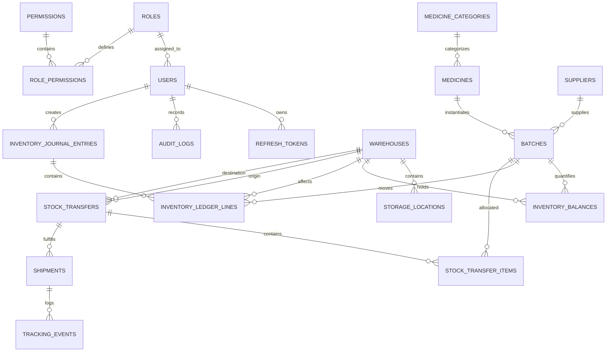

# MedTrack — Entity Relationship Diagram (ERD) & Physical Schema Reference

**Document Version:** 1.0.0  
**Target Engine:** PostgreSQL 18.6  
**Primary Key Strategy:** UUIDv7 where appropriate / UUID v4  

---

## 1. Visual Entity Relationship Diagram (Mermaid)

---

## 2. Table Summary & Core Responsibilities

| Table Name | Primary Purpose | Key Foreign Keys & Constraints |
| :--- | :--- | :--- |
| **`users`** | Operational user identity & status | `role_id -> roles(id)`, `assigned_warehouse_id -> warehouses(id)` |
| **`refresh_tokens`** | Single-use JWT refresh token rotation | `user_id -> users(id)`, `family_id` UUID, `is_revoked` BOOLEAN |
| **`medicines`** | Master drug catalog & shelf-life config | `category_id -> medicine_categories(id)`, `min_receiving_shelf_life_days` |
| **`batches`** | Physical pharmaceutical batches & expiry | `medicine_id -> medicines(id)`, `supplier_id -> suppliers(id)`, `expiry_date > mfg_date` |
| **`inventory_balances`** | Fast materialized snapshot of stock | `warehouse_id`, `batch_id`, `@Version` optimistic lock, `CHECK (available >= 0)` |
| **`inventory_journal_entries`** | Header for double-entry movements | `entry_type`, `reference_entity_type`, `reference_entity_id`, `performed_by` |
| **`inventory_ledger_lines`** | Balanced Debit/Credit legs with 3-bucket state | `journal_entry_id`, `account_type`, `direction IN ('DEBIT', 'CREDIT')`, `available/reserved/quarantined before/delta/after` |
| **`stock_transfers`** | Inter-warehouse movement intent & state | `source_warehouse_id`, `destination_warehouse_id`, `status` state machine |
| **`stock_transfer_items`** | Transfer item quantities & FEFO audit | `transfer_id`, `medicine_id`, `batch_id`, `fefo_overridden`, `override_reason` |
| **`shipments`** | Physical transportation lifecycle & carrier | `transfer_id`, `origin_warehouse_id`, `destination_warehouse_id`, `tracking_number` |
| **`tracking_events`** | In-transit milestone & GPS coordinates | `shipment_id`, `latitude`, `longitude`, `milestone_status` |
| **`audit_logs`** | Synchronous immutable forensic log | `user_id`, `action`, `entity_name`, `entity_id`, `changes_json` |
