# MedTrack — Implementation Roadmap & Phased Execution Plan

**Document Version:** 2.0.0  
**Status:** Approved for Implementation  
**Target System:** MedTrack Operational Platform (Web)  
**Author:** MedTrack Systems & Architecture Team  

---

## 1. Roadmap Overview & Phased Execution Strategy

MedTrack enforces a strict **Backend-First Engineering Sequencing**: domain invariants, database constraints, double-entry ledgers, and transfer state machines are built, validated, and stress-tested with automated acceptance tests (AC-01 through AC-04) before constructing the React frontend single-page application.

```mermaid
flowchart TD
    subgraph P1["Phase 1: Foundation, Auth & Master Data"]
        P1A["Spring Boot 4.1.1 + Postgres 18.6 + Flyway"] --> P1B["Auth + Single-Use RTR + RBAC"]
        P1B --> P1C["Medicine + Category Master"]
        P1C --> P1D["Batch Master + Configurable Shelf Life"]
        P1D --> P1E["Warehouse & Storage Locations"]
    end

    subgraph P2["Phase 2: Inventory Ledger, Balances, Inbound & FEFO"]
        P1E --> P2A["Inventory Balances (@Version Lock)"]
        P2A --> P2B["Double-Entry Journal & 3-Bucket Ledger"]
        P2B --> P2C["Inbound Receiving (Idempotent)"]
        P2C --> P2D["Automated FEFO Allocation Engine"]
    end

    subgraph P3["Phase 3: Transfer State Machine, Fulfillment & Shipments"]
        P2D --> P3A["Stock Transfer State Machine"]
        P3A --> P3B["Stock Reservation & Release"]
        P3B --> P3C["Pick / Pack & Manifest Generator"]
        P3C --> P3D["Shipment Dispatch & Store Receiving"]
        P3D --> P3E["Discrepancy Reconciliation"]
    end

    subgraph P4["Phase 4: Tracking Telemetry, Barcodes, Alerts & Reports"]
        P3E --> P4A["In-Transit Tracking & MockTrackingProvider"]
        P4A --> P4B["Google ZXing Barcode / QR Engine"]
        P4B --> P4C["Scheduled Operational Expiry Alerts"]
        P4C --> P4D["Synchronous Audit Logging & MDC Context"]
        P4D --> P4E["Reporting & Inventory Valuation APIs"]
    end

    subgraph P5["Phase 5: React Single-Page Application (Frontend)"]
        P4E --> P5A["Design System (tokens.css + tailwind.config.js)"]
        P5A --> P5B["Auth Flow & Silent Token Rotation"]
        P5B --> P5C["Executive Dashboard & KPI Widgets"]
        P5C --> P5D["Inventory Balances & Inbound Receiving"]
        P5D --> P5E["Transfer 4-Step Wizard & FEFO Override Modal"]
        P5E --> P5F["Shipments & Leaflet / OSM Live Transit Map"]
        P5F --> P5G["HTML5 WebRTC Camera QR Scanner"]
    end

    style P1 fill:#EFF6FF,stroke:#93C5FD
    style P2 fill:#EFF6FF,stroke:#93C5FD
    style P3 fill:#EFF6FF,stroke:#93C5FD
    style P4 fill:#EFF6FF,stroke:#93C5FD
    style P5 fill:#F0FDF4,stroke:#86EFAC
```

---

## Phase 1: Foundation, Authentication & Master Data
- **Objective:** Establish the Spring Boot foundation, PostgreSQL Flyway migration engine, RFC 7807 global exception handling, secure stateless JWT authentication with Refresh Token Rotation (RTR), and core master data entities.
- **Backend Modules:** `shared`, `auth`, `user`, `medicine`, `batch`, `warehouse`, `supplier`.
- **Database Migrations (`src/main/resources/db/migration/`):**
  - `V1__init_schema.sql` (Tables: `roles`, `permissions`, `role_permissions`, `users`, `refresh_tokens`, `medicine_categories`, `medicines`, `suppliers`, `batches`, `warehouses`, `storage_locations`).
  - `V2__seed_master_data.sql` (Seed system roles, default admin user, medicine categories, sample warehouses).
- **Core Implementations:**
  - `BaseEntity` (`id`, `createdAt`, `updatedAt`), `GlobalExceptionHandler` with RFC 7807 `ProblemDetail`.
  - `JwtProvider` (15-min access tokens) + `AuthService` with single-use Refresh Token Rotation (RTR) and token family reuse detection.
  - `MedicineService` & `MedicineController` (SKU format validation, configurable `min_receiving_shelf_life_days`).
  - `BatchService` & `BatchController` (Expiry validation engine against configurable medicine shelf-life).
  - `WarehouseService` & `WarehouseController` (Central vs Store locations, bin storage codes).
- **Primary API Endpoints:**
  - `POST /api/v1/auth/login`
  - `POST /api/v1/auth/refresh` (Rotates token & invalidates presented token)
  - `POST /api/v1/auth/logout`
  - `GET  /api/v1/medicines`
  - `POST /api/v1/medicines`
  - `GET  /api/v1/medicines/{id}`
  - `PUT  /api/v1/medicines/{id}`
  - `GET  /api/v1/batches`
  - `GET  /api/v1/batches/{id}`
  - `GET  /api/v1/warehouses`
- **Automated Tests:**
  - Unit tests for JWT issuance, claims parsing, and RTR replay detection.
  - **Automated Acceptance Test `AC-01`:** Inbound batch creation with expiry date $< \text{Current Date} + \text{medicine.min\_receiving\_shelf\_life\_days}$ is rejected with HTTP `422 Unprocessable Entity`.
- **Definition of Done (DoD):**
  - PostgreSQL boots via Docker and Flyway migrations execute cleanly.
  - User authentication and role guards work on all master data endpoints.
  - All Phase 1 tests pass with zero warnings.

---

## Phase 2: Inventory Balances, Double-Entry Ledger & FEFO Engine
- **Objective:** Build the immutable double-entry journal and ledger line architecture, optimistic-locked inventory balances with 3-bucket state snapshots, idempotent inbound receiving, and the deterministic FEFO allocation engine.
- **Backend Modules:** `inventory`, `shared`.
- **Database Migrations:**
  - `V3__inventory_ledger_schema.sql` (`inventory_balances`, `inventory_journal_entries`, `inventory_ledger_lines`).
- **Core Implementations:**
  - `InventoryBalance` entity with `@Version` optimistic locking and check constraints (`available_quantity >= 0`, `reserved_quantity >= 0`, `quarantined_quantity >= 0`).
  - `DoubleEntryLedgerService` enforcing balanced legs ($\sum \text{Debits} = \sum \text{Credits}$) and recording explicit before/delta/after snapshots across `available`, `reserved`, and `quarantined` buckets.
  - `InboundService` managing supplier consignments with mandatory `X-Idempotency-Key` headers.
  - `FefoAllocationEngine` (`ORDER BY b.expiry_date ASC, b.id ASC FOR UPDATE`) for deterministic stock reservation.
  - Strict FEFO manual override handler requiring `override_reason` and committing synchronous audit logs.
- **Primary API Endpoints:**
  - `GET  /api/v1/inventory/balances`
  - `POST /api/v1/inventory/inbound` (Atomic consignment receipt + double-entry journal)
  - `POST /api/v1/inventory/adjustments` (Cycle count adjustments with mandatory notes)
  - `GET  /api/v1/inventory/journal-entries` (Chronological double-entry journal history)
  - `GET  /api/v1/inventory/journal-entries/{id}` (Detail with balanced Debit & Credit lines)
- **Automated Tests:**
  - **Automated Acceptance Test `AC-02` (FEFO Allocation Priority):** Test allocating from multiple candidate batches; assert batch with earliest expiration is picked first.
  - **Automated Acceptance Test `AC-03` (Negative Inventory Prevention):** Concurrency stress test (50 parallel threads) asserting that inventory balances never drop below 0 and optimistic locking triggers clean 409 responses.
  - Double-entry balance test asserting $\sum \text{Debits} = \sum \text{Credits}$ across all operational journal types.
- **Definition of Done (DoD):**
  - Inbound receiving atomically updates physical stock and appends balanced ledger lines.
  - FEFO algorithm correctly selects candidate batches and reserves stock without race conditions.

---

## Phase 3: Stock Transfer State Machine, Fulfillment & Shipments
- **Objective:** Implement the end-to-end stock transfer lifecycle, reservation/release mechanics, pick/pack verification, physical shipment creation, and destination store receiving with discrepancy reconciliation.
- **Backend Modules:** `transfer`, `shipment`.
- **Database Migrations:**
  - `V4__transfer_and_shipment_schema.sql` (`stock_transfers`, `stock_transfer_items`, `shipments`, `shipment_items`).
- **Core Implementations:**
  - `TransferService` managing the deterministic state machine:
    $$\text{DRAFT} \longrightarrow \text{REQUESTED} \longrightarrow \text{APPROVED} \longrightarrow \text{ALLOCATED} \longrightarrow \text{PICKED} \longrightarrow \text{PACKED} \longrightarrow \text{DISPATCHED} \longrightarrow \text{RECEIVED} \longrightarrow \text{COMPLETED}$$
  - Stock Reservation on approval/allocation, and automatic release on transfer cancellation.
  - Pick and Pack verification service generating warehouse bin pick-lists.
  - `ShipmentService` managing carrier assignments, tracking numbers, and dispatch manifests.
  - Dispatch transaction: Credits source warehouse `WAREHOUSE_ACTIVE` balance and debits `IN_TRANSIT` account.
  - Receiving transaction: Credits `IN_TRANSIT` account and debits destination `WAREHOUSE_ACTIVE` balance; automatically transitions transfer to `DISCREPANCY_FLAGGED` if received count $<$ dispatched count.
- **Primary API Endpoints:**
  - `POST /api/v1/stock-transfers` (Create transfer request)
  - `POST /api/v1/stock-transfers/{id}/approve`
  - `POST /api/v1/stock-transfers/{id}/allocate` (Triggers FEFO reservation)
  - `POST /api/v1/stock-transfers/{id}/override-allocation` (Audited manual override)
  - `POST /api/v1/stock-transfers/{id}/pack`
  - `POST /api/v1/stock-transfers/{id}/dispatch`
  - `POST /api/v1/stock-transfers/{id}/receive` (Receives stock at destination)
  - `POST /api/v1/shipments` (Creates shipment from packed transfer)
  - `GET  /api/v1/shipments/{id}`
  - `GET  /api/v1/shipments/{id}/manifest`
- **Automated Tests:**
  - **Automated Acceptance Test `AC-04` (Duplicate Receiving Protection):** Calling receive on an already delivered shipment returns HTTP `409 Conflict` with code `SHIPMENT_ALREADY_RECEIVED`.
  - Transfer cancellation test verifying all reserved inventory is returned to available stock.
  - Discrepancy test verifying damaged units transition to `WRITE_OFF_LOSS` ledger leg.
- **Definition of Done (DoD):**
  - Full transfer lifecycle executes from creation to receipt with 100% balanced ledger lines.

---

## Phase 4: Tracking Telemetry, Barcodes, Alerts & Reports
- **Objective:** Implement transportation tracking with first-class simulation providers, QR/Barcode generation, scheduled operational alerts, synchronous audit logging, and management reports.
- **Backend Modules:** `tracking`, `notification`, `report`, `audit`.
- **Database Migrations:**
  - `V5__tracking_alerts_audit_schema.sql` (`tracking_events`, `notifications`, `audit_logs`).
- **Core Implementations:**
  - `ShipmentTrackingProvider` interface with `MockTrackingProvider` (`@Profile("dev | local")`) simulating live GPS waypoint coordinates along polyline routes.
  - `BarcodeGenerator` using Google ZXing (`com.google.zxing:core:3.5.3`) generating SVG and PNG data URIs for batch and shipment QR labels.
  - `NotificationService` and `@Scheduled` background engine checking for:
    - Low stock $\le \text{min\_stock\_threshold}$
    - Expiry warnings (90, 60, 30 days)
    - In-transit shipment delays ($\text{Current Time} > \text{ETA}$)
  - Synchronous Audit Trail (`audit_logs`) committed within the same database transaction for inventory adjustments, FEFO overrides, and role changes.
  - `ReportService` providing inventory valuation, expiry risk summaries, and streaming CSV exports.
- **Primary API Endpoints:**
  - `GET  /api/v1/shipments/{id}/tracking`
  - `POST /api/v1/shipments/{id}/events` (Log checkpoint milestone)
  - `GET  /api/v1/batches/{id}/qr-code`
  - `GET  /api/v1/notifications`
  - `PATCH /api/v1/notifications/{id}/read`
  - `GET  /api/v1/audit-logs`
  - `GET  /api/v1/reports/expiry`
  - `GET  /api/v1/reports/inventory`
- **Automated Tests:**
  - Unit tests for `MockTrackingProvider` waypoint calculations and event generation.
  - Integration test verifying audit records are synchronously inserted during inventory adjustments.
  - Scheduled alert test verifying 30/60/90-day expiry notifications are emitted.
- **Definition of Done (DoD):**
  - Complete backend API surface is functional, documented in OpenAPI/Swagger UI, and verified by integration tests.

---

## Phase 5: React Single-Page Application (Frontend)
- **Objective:** Construct the dense, responsive, accessible React single-page application adhering strictly to `design.md`.
- **Frontend Modules (`frontend/src/`):**
  - `styles/`: CSS custom properties in `tokens.css` mapped in `tailwind.config.js`.
  - `components/`: Headless atomic components (`Button`, `Input`, `Table` with 8 states, `Badge`, `Modal`, `AppShell`).
  - `features/`:
    - `auth/`: Login screen with validation, silent JWT refresh interceptor.
    - `dashboard/`: Executive KPI cards, real-time expiry risk widget, recent shipments table.
    - `inventory/`: Multi-warehouse stock balance table (3-bucket pill component), Inbound Receiving form with QR label preview.
    - `transfers/`: 4-step Transfer Stepper Wizard, FEFO Allocation review, and FEFO Override modal with mandatory reason textarea.
    - `shipments/`: Shipment management table, printable barcode manifests.
    - `tracking/`: Interactive Leaflet + OpenStreetMap transit visualizer rendering route polylines and milestone waypoint timeline.
    - `scanner/`: Integrated HTML5 WebRTC camera QR scanner with fallback keyboard wedge support.
    - `audit/` & `reports/`: Compliance audit log viewer with JSON diff inspector and CSV export trigger.
- **Automated Tests:**
  - Vitest + React Testing Library component tests.
  - Cypress / Playwright end-to-end user journey tests (Login $\rightarrow$ Inbound Receive $\rightarrow$ Transfer Request $\rightarrow$ FEFO Allocate $\rightarrow$ Dispatch $\rightarrow$ Receive).
- **Definition of Done (DoD):**
  - All 8 table states render cleanly.
  - Dark-mode ready CSS tokens applied across all components.
  - End-to-end user journeys pass smoothly without console errors.
